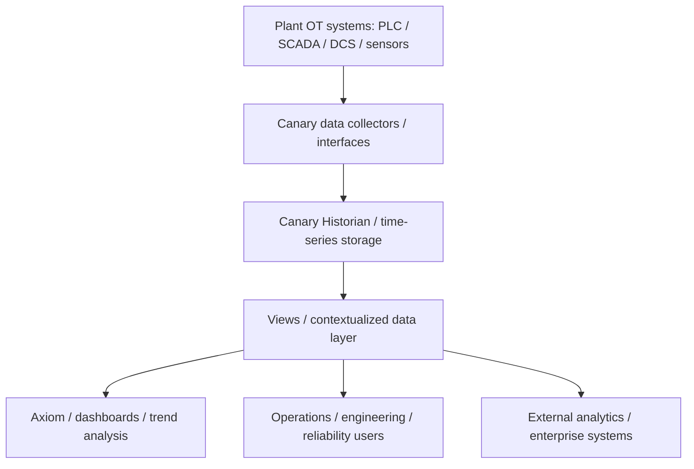

# Canary

## Executive Summary

Canary is an industrial historian and time-series data foundation for plant and operational technology environments. Position it when a customer needs to collect, store, organize, visualize, and make industrial process data usable for operations, engineering, reliability, and analytics workflows.

At a practical presales level, Canary belongs in conversations about scattered OT data, missing historical visibility, hard-to-use tag data, dashboarding, trend analysis, contextualized historian views, and analytics-ready plant data. Treat it as historian-centered infrastructure, not as a full APM platform.

This page is for internal draft use. The top sections are written for quick sales/presales orientation; the lower sections preserve evidence links, validation notes, open questions, and restricted-content handling.

## Where It Fits

| Fit Area | Presales Guidance | Confidence |
|---|---|---|
| Primary positioning conversation | Industrial historian, plant time-series data, trend review, contextualized data access, and dashboards. | Validated draft |
| Primary audience | Operations, engineering, reliability, automation, and data/analytics teams. | Validated draft |
| Data relationship | Collects and stores operational time-series data and exposes it through views, visualization, calculations, and downstream access paths. | Partially validated |
| APM relationship | Can support APM or reliability workflows as a data foundation, but it should not be positioned as an APM product from the current reviewed scope. | Still to validate |
| IIoT relationship | Can sit in a plant data layer around industrial automation and edge contexts, but broad IIoT-platform claims remain open. | Partially validated |
| Comparison positioning | Keep Canary vs AVEVA PI conclusions deferred until AVEVA PI evidence is reviewed. | Still to validate |

## Customer Problems It Addresses

| Customer Problem | How Canary Helps |
|---|---|
| OT data is scattered across systems and difficult to reuse. | Provides historian-centered data collection, storage, and access patterns for industrial process data. |
| Teams cannot easily see historical trends. | Axiom supports dashboards, trends, and reports around historian data. |
| Raw tags lack operating context. | Views and asset modeling help organize data into more meaningful structures. |
| Calculations and event visibility are handled inconsistently. | Calculation server and event monitoring are supported at overview level and need deeper validation for design use. |
| Analytics teams need usable plant data. | Canary can act as a historian-centered data layer for downstream analytics, while exact APIs and enterprise integration remain to validate. |

## What It Does

| Capability Area | Plain-Language Description | Confidence |
|---|---|---|
| Data collection | Brings industrial process data into the historian layer from automation, edge, and IIoT device contexts. | Partially validated |
| Historian storage | Stores operational time-series/tag data for later review and use. | Partially validated |
| Views / contextualization | Organizes historian data through virtual views and asset modeling. | Partially validated |
| Visualization | Provides Axiom dashboards, trends, and reports for user-facing analysis. | Validated draft |
| Calculations | Supports calculation capabilities around historian data. | Partially validated |
| Event monitoring | Supports event-monitoring concepts tied to operational data. | Partially validated |
| Data access | Can support downstream data use, but exact connector/API details require additional validation. | Still to validate |

## Validation Status

- Validated draft: historian-centered positioning, Axiom visualization, high-level collection/storage/contextualization/calculation/event-monitoring concepts.
- Partially validated: edge/site/enterprise/cloud positioning, virtual views, asset modeling, deployment patterns, and downstream data access.
- Still to validate: supported collectors/protocols, retention behavior, compression, sizing, security, store-and-forward, API/Excel access, operational limits, and Canary vs AVEVA PI comparison.

## Product Positioning

For presales purposes, treat Canary as an industrial historian and time-series data foundation. It fits opportunities where the customer needs a reliable way to collect operational data, preserve history, organize data into useful views, and make that data available through trends, dashboards, reports, calculations, and downstream analytics paths.

Canary is useful in plant data conversations, especially when the customer is asking about OT data visibility, historian modernization, contextualized tag data, or analytics-ready process data. Do not position it as a full APM platform, and keep Canary vs AVEVA PI comparison conclusions in a later comparison batch.

## Architecture Overview

Canary can be explained to customers as a historian-centered data layer. Plant OT data flows from PLCs, SCADA, DCS, sensors, edge systems, or other automation sources into Canary collection and historian storage. Users can then organize the data through views, explore it through Axiom dashboards and trends, and prepare it for calculations, event monitoring, or downstream analytics.

In a typical discussion, position the architecture as four logical layers: data collection, historian storage, contextualized views, and user or downstream access. Collector details, retention model, security model, deployment topology, and external interfaces should be validated during solution planning.

Diagram caption: This conceptual view shows Canary as a historian-centered data flow from plant OT systems into collectors, historian storage, contextualized views, visualization, users, and downstream access. Collector details, deployment topology, external-system interfaces, and protocol/API support remain implementation validation items.

## Core Components

| Component | Role | Presales Explanation |
|---|---|---|
| Data collectors / interfaces | Data ingestion | Bring industrial process data into the historian layer from automation, edge, or related OT contexts. |
| Canary Historian / time-series storage | Historical data foundation | Stores operational tag/time-series data for trend review, reporting, calculations, and reuse. |
| Views / contextualized data layer | Data organization | Helps users organize historian data into more meaningful asset or operational views. |
| Axiom visualization | User analysis surface | Provides dashboards, trends, and reports for operations, engineering, and reliability users. |
| Calculation server | Derived metrics | Supports calculated values and operational metrics around historian data. |
| Event monitoring | Operational visibility | Supports event-oriented review around industrial data. |
| Data connectors / downstream access | Data reuse | Enables data to be used beyond the historian, subject to connector/API validation. |

## Integration Notes

Canary integration discussions should start with the customer’s OT data sources and historian goals. Confirm which PLC, SCADA, DCS, sensor, edge, existing historian, or enterprise analytics paths are in scope before naming exact interfaces or APIs.

For early presales, keep the integration story simple: collect plant data, store time-series history, organize the data into views, visualize it, and prepare it for calculations, events, or downstream analytics. Detailed protocol lists, Excel/API access, store-and-forward behavior, and AVEVA PI migration claims require further source review.

## Deployment Notes

Canary can be discussed in site, edge, enterprise, and cloud-oriented historian conversations, but the exact architecture should be confirmed per opportunity. Treat site historian, enterprise historian, and cloud/hosted patterns as planning options until deployment documents and customer requirements are reviewed.

Before solution design, validate collection topology, retention sizing, redundancy, backup/restore, security, user access, network zones, operational ownership, and store-and-forward expectations.

## Typical Use Cases

| Use Case | Presales Description |
|---|---|
| Industrial process history | Store and retrieve operational time-series data for operations and engineering review. |
| Trends, dashboards, and reports | Use Axiom to review historian data through trends, dashboards, and reports. |
| Contextualized historian access | Organize historian data into views that are easier for operations and engineering users to understand. |
| Operational calculations | Derive operational metrics from historian data for analysis and reporting. |
| Event monitoring | Support event-oriented review around operational data. |
| Tender historian requirements | Use Canary as a candidate reference for collection, storage, contextualization, visualization, and data-access discussions. |

Industry-specific and case-study benefits remain deferred until selected primary case-study documents are reviewed. Non-pricing benefits may be included later only when reviewed.

## Presales Qualification Notes

- Position Canary when the customer needs an industrial historian, time-series data foundation, contextualized plant data, dashboards/trends, or analytics-ready operational data.
- Confirm whether the customer needs a site historian, enterprise historian pattern, edge/site/cloud data path, or historian-adjacent analytics layer.
- Ask which OT systems, tags, assets, views, dashboards, calculations, events, and downstream systems are in scope.
- Keep Canary vs AVEVA PI and historian migration language out of the main positioning conversation until the comparison evidence is ready.
- Treat exact protocol/API, retention, compression, sizing, security, and store-and-forward details as validation topics.

## What To Validate With Customer

- Which SCADA, DCS, PLC, sensor, edge, or existing historian sources need to be connected?
- What historical retention, sampling, compression, performance, and availability expectations apply?
- Does the customer need contextualized views, asset modeling, namespace governance, or virtual views?
- Which dashboards, trends, reports, calculations, and event-monitoring workflows are required?
- What security, access-control, backup/restore, and operational responsibilities apply?
- Which comparison questions against AVEVA PI should be deferred to the dedicated comparison page?

## Evidence Sources

| Source ID | Title | Link | Evidence Role | Review Status |
|---|---|---|---|---|
| `SRC-APM-IIOT-0001` | AVENUE APM & IIoT Solutions | [Open source](<https://docs.google.com/spreadsheets/d/1OKfe48zNwTjB1196QU45f8jqNyT8OyszAwLQ-D1gdEw>) | Initial Batch 1 portfolio-level draft context | Draft extracted |
| `SRC-APM-IIOT-0010` | Canary source folder | [Open source](<https://drive.google.com/drive/folders/1HFjWEw-kl8ExbDkf3hoMXsaBmBAUMdUk>) | Parent Canary source folder | Document audit completed |
| `SRC-CANARY-DOC-0001` | Canary System Brochure.pdf | [Open source](<https://drive.google.com/file/d/1PmiSjOIIb7qZYqfFgGO5lDxTkO3lsNZx/view?usp=drivesdk>) | Primary reviewed source for this enrichment pass: overview, historian positioning, core capability framing | In progress |
| `SRC-CANARY-DOC-0002` | Canary.docx | [Open source](<https://docs.google.com/document/d/1CRUiDWDsmWqnHgPIVFIB9vYH2actwYZl/edit?usp=drivesdk&ouid=108564093758567510758&rtpof=true&sd=true>) | Future validation target for source summary, product scope, draft-fact crosscheck, and open questions | Not started |
| `SRC-CANARY-DOC-0003` | Virtualize Your World.pdf | [Open source](<https://drive.google.com/file/d/1LxiG-gfofUMwK0Xsl_jdyIT9N8e5-8dN/view?usp=drivesdk>) | Future validation target for virtual views, contextualization, asset modeling, and namespace strategy | Not started |
| `SRC-CANARY-EXTRACT-0001` | 01_Canary Extracted Keys.md | [Open source](<https://drive.google.com/file/d/18Mc1wWkPBeMU3gai893-4wFM84EofiCZ/view?usp=drivesdk>) | Derived review aid only; candidate fact discovery | Not evidence for final claims |
| `SRC-CANARY-EXTRACT-0002` | 02_Canary Business Section.md | [Open source](<https://drive.google.com/file/d/1MpHOeUkZ7ouxkwFrQj6mf56SR2fP4I5n/view?usp=drivesdk>) | Derived review aid only; candidate business/use-case framing | Not evidence for final claims |
| `SRC-CANARY-EXTRACT-0003` | 03_Canary Technical Section.md | [Open source](<https://drive.google.com/file/d/1E5i32MlSTzOq0s7S9VWieWU58Nm0MMdr/view?usp=drivesdk>) | Derived review aid only; candidate technical architecture and integration checklist support | Not evidence for final claims |
| `SRC-CANARY-EXTRACT-0004` | 04_Canary Use cases, BOM and Deployment.md | No wiki evidence link; restricted pricing-risk source | Excluded from wiki enrichment except to identify restricted content | Restricted / not used |

## Source-Backed Draft Notes

### Source Coverage

| Source ID | Source Title | Extraction Status | Notes |
|---|---|---|---|
| `SRC-APM-IIOT-0001` | AVENUE APM & IIoT Solutions | Batch 1 draft extracted | Main source used for the initial Canary draft extraction batch; reference URLs in the sheet were treated only as supporting references. |
| `SRC-APM-IIOT-0010` | Canary | Batch 1.4 document audit completed | Registered Canary source folder and document inventory. |
| `SRC-CANARY-DOC-0001` | Canary System Brochure.pdf | Batch 1.5 validation in progress | Reviewed for overview-level historian positioning, core capability framing, deployment positioning, and product boundaries. |
| `SRC-CANARY-DOC-0002` | Canary.docx | Not started | Deferred validation target for crosschecking product scope and open questions. |
| `SRC-CANARY-DOC-0003` | Virtualize Your World.pdf | Not started | Deferred validation target for virtual views, contextualization, asset modeling, and namespace strategy. |
| `SRC-CANARY-EXTRACT-0001` to `SRC-CANARY-EXTRACT-0003` | Canary NotebookLM markdown summaries | Review aids only | Used only for organizing candidate review topics; not treated as primary evidence. |

### Draft Facts from Source

| Topic | Draft Note | Evidence Source | Review Status |
|---|---|---|---|
| General concept | Canary is a historian-centered technology for industrial automation and operational time-series data. | `SRC-CANARY-DOC-0001` | Source-backed draft |
| Vendor / ownership context | The Batch 1 sheet lists Canary Labs from the United States, but legal vendor identity and country remain to validate from authoritative product or vendor material. | `SRC-APM-IIOT-0001`; `SRC-CANARY-DOC-0001` | Still to validate |
| Historian positioning | Canary should be treated primarily as an industrial historian candidate in this wiki. | `SRC-CANARY-DOC-0001` | Source-backed draft |
| Core capabilities | Reviewed evidence supports collection, historian storage, virtual views, asset modeling, Axiom visualization, calculation server, event monitoring, and general data connector framing. | `SRC-CANARY-DOC-0001` | Source-backed draft at overview level |
| Data collection | Canary is relevant for collecting process data from industrial automation, edge, and IIoT device contexts; exact collectors and protocols remain unresolved. | `SRC-CANARY-DOC-0001` | Partially supported |
| Data storage | Canary supports historian tag storage and time-series storage positioning; retention, compression, scale, and performance details require technical validation. | `SRC-CANARY-DOC-0001` | Partially supported |
| Contextualization | Virtual views and asset modeling are supported at overview level; detailed namespace strategy should be validated against `SRC-CANARY-DOC-0003`. | `SRC-CANARY-DOC-0001`, `SRC-CANARY-DOC-0003` target | Partially supported |
| Visualization | Axiom supports dashboards, trends, and reports at an overview level. | `SRC-CANARY-DOC-0001` | Source-backed draft |
| Deployment | Edge, site, enterprise, and cloud positioning are supported at a high level; exact deployment models and ownership boundaries remain open. | `SRC-CANARY-DOC-0001` | Partially supported |
| Product boundary | Canary is historian-centered and may support downstream analytics/reporting workflows, but reviewed evidence does not establish Canary as a broad APM or general IIoT platform. | `SRC-CANARY-DOC-0001` | Conservative boundary note |

## Document-Level Validation Notes

### Document Coverage

| Source ID | Document Title | Validation Role | Extraction Status |
|---|---|---|---|
| `SRC-CANARY-DOC-0001` | Canary System Brochure.pdf | Primary reviewed source for overview, historian positioning, product boundaries, and high-level capabilities. | In progress |
| `SRC-CANARY-DOC-0002` | Canary.docx | Deferred secondary source for source-summary crosscheck, product scope, and open-question review. | Not started |
| `SRC-CANARY-DOC-0003` | Virtualize Your World.pdf | Deferred secondary source for Virtual Views, contextualization, asset modeling, and namespace validation. | Not started |

### Validated / Refined Draft Facts

| Topic | Batch 1 Draft Note | Validation Result | Evidence Source | Review Status |
|---|---|---|---|---|
| General concept | Canary is described as a time-series database and industrial historian for industrial automation. | Refined by source: current page describes Canary as historian technology for industrial automation and operational time-series data. | `SRC-CANARY-DOC-0001` | Draft validation note |
| Vendor | Canary Labs from the United States is listed as the vendor in Batch 1. | Still to validate: use neutral product wording until vendor legal identity and country are confirmed. | `SRC-APM-IIOT-0001`, `SRC-CANARY-DOC-0001` | Needs source crosscheck |
| Historian positioning | Canary should be treated primarily as an Industrial Historian candidate. | Validated by source at overview level. | `SRC-CANARY-DOC-0001` | Draft validation note |
| Core capabilities | Candidate capabilities include collection, high-volume storage, contextualization, asset modeling, visualization, calculations, and downstream access. | Refined by source: current page uses brochure-supported terms and keeps detailed architecture unresolved. | `SRC-CANARY-DOC-0001` | Draft validation note |
| Data collection | Batch 1 described continuous industrial data collection from automation sources. | Refined by source: collection from industrial automation, edge, and IIoT device contexts is supported at high level; exact interfaces remain to validate. | `SRC-CANARY-DOC-0001` | Partial validation |
| Data storage | Batch 1 described high-volume time-series storage and preservation of raw historian data. | Refined by source: historian storage is supported at overview level; retention, compression, and performance details remain to validate. | `SRC-CANARY-DOC-0001` | Partial validation |
| Contextualization / virtual views | Batch 1 included contextualization, asset modeling, and unified namespace concepts. | Refined by source: virtual views and asset modeling are supported at overview level; namespace terminology requires deeper validation. | `SRC-CANARY-DOC-0001`, `SRC-CANARY-DOC-0003` target | Partial validation |
| Deployment model | Batch 1 listed site historian, enterprise historian, local-to-central patterns, on-premises, and cloud as candidate models. | Refined by source: edge, site, enterprise, and cloud positioning are supported at brochure level only. | `SRC-CANARY-DOC-0001` | Partial validation |
| Product boundaries | Batch 1 treated Canary as a historian candidate with downstream analytics/reporting support. | Refined by source: historian-centered boundary retained; APM, broad IIoT platform, and comparison conclusions remain deferred. | `SRC-CANARY-DOC-0001` | Conservative boundary note |
| Limitations | Batch 1 noted product limits, supported connectors, deployment constraints, and comparison conclusions still require validation. | Still to validate: current reviewed evidence is not sufficient for detailed limits, connectors, retention behavior, security, or AVEVA PI comparison. | `SRC-CANARY-DOC-0001` | Needs additional documents |

## Open Questions

- Which document confirms current supported collectors, protocols, and interface details?
- Which source validates retention behavior, compression model, performance, and sizing assumptions?
- Which source confirms Excel access, API-style access, and downstream analytics integration?
- Which source confirms store-and-forward behavior, if it is part of the current Canary deployment model?
- Which deployment source explains edge, site, enterprise, cloud, and local-to-central architecture patterns?
- Which document should define security model, access control, backup/restore, and operational limits?
- Which product or module boundaries are technical boundaries versus restricted licensing/commercial boundaries? Licensing and commercial details remain excluded from this wiki page.
- Which claims from `SRC-CANARY-DOC-0003` can safely support Virtual Views, asset modeling, and namespace strategy?
- Which Canary claims can be compared with AVEVA PI only after AVEVA PI source documents are reviewed?

## Excluded Content

- Pricing, licensing, discounts, commercial quotes, proposal prices, budgetary prices, BOM prices, service fees, support fees, training fees, and commercial terms are excluded from this wiki page.
- `SRC-CANARY-EXTRACT-0004` is a high-pricing-risk derived source and was not used for wiki enrichment.
- Case-study claims and quantified benefits remain deferred until selected primary case-study documents are reviewed and commercial content is excluded.
- NotebookLM-derived content is not treated as approved knowledge and cannot independently support wiki claims.

## Review Notes

- Keep this page `draft`, `private`, and `confidence: low` until human review is complete.
- Keep Canary vs AVEVA PI conclusions deferred until both products have source-backed validation.
- Move reusable neutral historian concepts to the Industrial Historian capability page only after additional validation.
