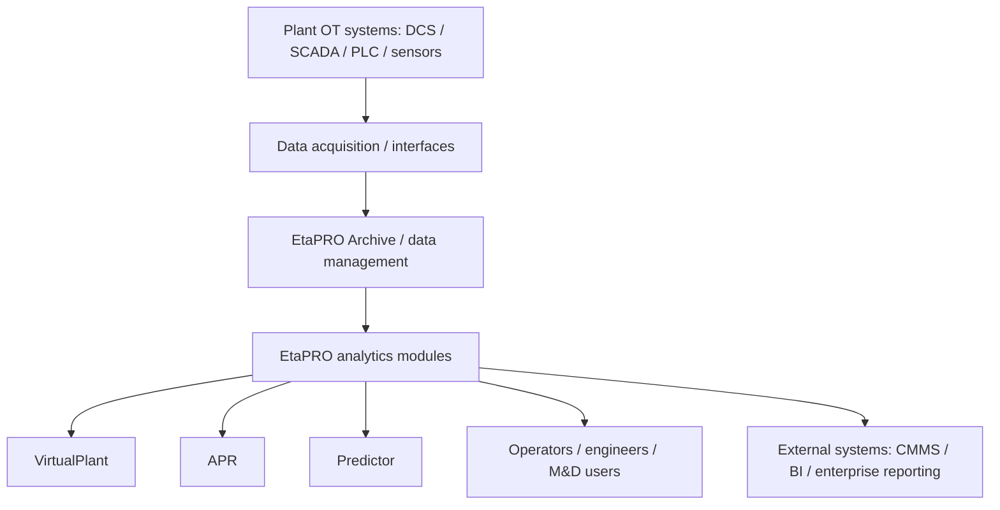

# EtaPRO

## Executive Summary

EtaPRO is a draft APM, performance monitoring, and condition monitoring solution page for power-generation contexts. Primary EtaPRO sources describe it as a real-time performance and condition monitoring platform that combines plant data management, thermodynamic modeling, anomaly detection, machinery diagnostics, reporting, and user-facing monitoring tools. Evidence: `SRC-ETAPRO-DOC-0002`, `SRC-ETAPRO-DOC-0003`, `SRC-ETAPRO-DOC-0005`. Review status: draft, source-backed, pending human review.

In this wiki, EtaPRO is most useful for teams evaluating power plant performance management, early anomaly detection, predictive maintenance, and historian-linked analytics. It should not yet be treated as a final vendor claim set; deployment, protocol, security, limitation, and product-boundary details still need deeper review. Evidence: `SRC-ETAPRO-DOC-0001`, `SRC-ETAPRO-DOC-0004`. Review status: partially validated.

## Scope

- In scope:
  - EtaPRO as a candidate APM, performance monitoring, or condition monitoring solution for power generation.
  - Source-backed module, integration, deployment, and use-case notes.
  - Draft support for tender preparation and future comparison analysis.
- Out of scope:
  - final vendor claims before human review;
  - pricing, licensing, BOM, quote, fee, discount, or commercial terms;
  - public marketing content;
  - unsupported comparison claims against IBM MAS or other APM solutions.

## Product Positioning

| Positioning Area | Draft Position | Evidence | Review Status |
|---|---|---|---|
| APM / performance management | EtaPRO is positioned as a performance and condition monitoring platform for power-generation assets, with APM-oriented use around performance, reliability, diagnostics, and operations visibility. | `SRC-ETAPRO-DOC-0001`, `SRC-ETAPRO-DOC-0002`, `SRC-ETAPRO-DOC-0005` | Source-backed draft |
| Relationship to historian / PIMS | EtaPRO Archive is described as the data archive / historian component used for process data, calculated results, trends, reporting, and downstream EtaPRO applications. | `SRC-ETAPRO-DOC-0003`, `SRC-ETAPRO-DOC-0004`, `SRC-ETAPRO-DOC-0005` | Source-backed draft |
| Relationship to condition monitoring | APR is described as an advanced pattern recognition component for anomaly detection and condition monitoring using empirical models of normal operation. | `SRC-ETAPRO-DOC-0007`, `SRC-ETAPRO-DOC-0003` | Source-backed draft |
| Relationship to predictive maintenance | Predictor is described as a rotating machinery diagnostics component using vibration and machinery dynamics data to identify developing faults and support action planning. | `SRC-ETAPRO-DOC-0008`, `SRC-ETAPRO-DOC-0003` | Source-backed draft |
| Relationship to IIoT | EtaPRO can consume plant data from OT systems and interfaces, but the current reviewed sources do not establish EtaPRO as a general-purpose IIoT platform. | `SRC-ETAPRO-DOC-0001`, `SRC-ETAPRO-DOC-0004` | Still to validate |
| Relationship to EAM / CMMS | Avenue context describes an EtaPRO-to-Maximo handoff concept for abnormal-condition follow-up, but official product integration details remain unvalidated. | `SRC-ETAPRO-DOC-0001` | Partially supported |

## Architecture Overview

The current source-backed draft architecture treats EtaPRO as a Client/Server platform that connects plant data sources to EtaPRO data management, analytics modules, and user-facing tools. `SRC-ETAPRO-DOC-0004` supports Client/Server architecture, centralized or decentralized topology options, TCP/IP client communication, client caching/compression, and web/mobile access. `SRC-ETAPRO-DOC-0001` supports a high-level Avenue integration view from OT systems into EtaPRO Archive, APR, and Virtual Plant, with a possible Maximo handoff that still needs official integration validation.

TODO: Enable Mermaid rendering in Docusaurus if needed. The current Docusaurus configuration does not explicitly enable Mermaid, so this diagram is included as a fenced `mermaid` block.

Diagram evidence: `SRC-ETAPRO-DOC-0001`, `SRC-ETAPRO-DOC-0004`, `SRC-ETAPRO-DOC-0005`. Review status: conceptual draft. External-system and protocol details remain `Still to validate`.

## Core Modules

| Module | Role | Candidate Capabilities | Evidence | Review Status |
|---|---|---|---|---|
| Archive / EPArchive | Data management and historian-like foundation for EtaPRO results and process data. | Stores and serves process data, calculated results, trends, reports, event counts, operating hours, KPIs, and production metrics. | `SRC-ETAPRO-DOC-0001`, `SRC-ETAPRO-DOC-0003`, `SRC-ETAPRO-DOC-0004`, `SRC-ETAPRO-DOC-0005` | Source-backed draft |
| VirtualPlant | Thermodynamic modeling and performance analysis module. | Builds first-principles models of plant cycles; supports online and offline analysis, performance targets, process-data validation, reference-condition correction, and what-if studies. | `SRC-ETAPRO-DOC-0001`, `SRC-ETAPRO-DOC-0003`, `SRC-ETAPRO-DOC-0004`, `SRC-ETAPRO-DOC-0006` | Source-backed draft |
| APR | Advanced pattern recognition / anomaly detection module. | Compares current operating data against empirical models of normal behavior; supports early warning, management-by-exception review, alert tracking, and condition monitoring. | `SRC-ETAPRO-DOC-0001`, `SRC-ETAPRO-DOC-0003`, `SRC-ETAPRO-DOC-0004`, `SRC-ETAPRO-DOC-0007` | Source-backed draft |
| Predictor | Machinery diagnostics module for rotating equipment. | Uses vibration and machinery-dynamics data to detect, diagnose, and forecast development of rotating-machine faults; supports AutoDiagnosis and time-to-action style review. | `SRC-ETAPRO-DOC-0001`, `SRC-ETAPRO-DOC-0003`, `SRC-ETAPRO-DOC-0004`, `SRC-ETAPRO-DOC-0008` | Source-backed draft |
| Monitoring / diagnostics utilities | Supporting tools around visibility, logging, reporting, trend review, and issue follow-up. | Candidate utilities include EPLog, EPTrendSetter, EPReporter, EPAccumulator, Concerns Viewer, web client, dashboards, logging, reporting, data mining, and alert/diagnostic workflows. | `SRC-ETAPRO-DOC-0003`, `SRC-ETAPRO-DOC-0004`, `SRC-ETAPRO-DOC-0005`, `SRC-ETAPRO-DOC-0009` | Source-backed draft; utility boundaries still to validate |
| FDM/PASS | Product-boundary item only. | Registered as a module/product area in source material, but commercial/accounting/settlement details are excluded from this wiki page. | `SRC-ETAPRO-DOC-0004` | Still to validate; commercial details excluded |

## Integration Notes

| Integration Area | Draft Note | Evidence | Review Status |
|---|---|---|---|
| Plant OT data flow | Reviewed sources support a high-level flow from plant sensors and DCS/SCADA/PLC systems into EtaPRO Archive and analytics modules. | `SRC-ETAPRO-DOC-0001`, `SRC-ETAPRO-DOC-0004` | Partially supported |
| EtaPRO data interfaces | `SRC-ETAPRO-DOC-0005` lists available real-time interfaces including OPC DA, Modbus, ODBC, text, and PI. `SRC-ETAPRO-DOC-0004` also references OPC, OLE-DB, and ODBC in the EPArchive context. | `SRC-ETAPRO-DOC-0004`, `SRC-ETAPRO-DOC-0005` | Source-backed draft for listed interfaces only |
| PI / source historian relationship | Sources describe APR leveraging historical data in EPArchive and PI systems, and EPArchive working in varied historian environments. | `SRC-ETAPRO-DOC-0003`, `SRC-ETAPRO-DOC-0004` | Source-backed draft |
| Maximo / CMMS handoff | Avenue context describes EtaPRO abnormal-condition detection leading to work request or work order creation in IBM Maximo, but this is not yet validated as official EtaPRO product integration. | `SRC-ETAPRO-DOC-0001` | Partially supported; still to validate |
| Reporting and user tools | Sources support reporting, logging, trending, data mining, dashboards, and web/mobile access as EtaPRO user-facing or supporting capabilities. | `SRC-ETAPRO-DOC-0003`, `SRC-ETAPRO-DOC-0004`, `SRC-ETAPRO-DOC-0005` | Source-backed draft |
| Enterprise systems beyond CMMS / reporting | ERP, LIMS, MES, BI, weather-service, and other enterprise integrations are not yet validated enough for this page. | `SRC-ETAPRO-EXTRACT-0003` as review aid only | Still to validate |

Do not add wider protocol lists from derived sources until each protocol or API is validated by primary EtaPRO documents.

## Deployment Notes

| Topic | Draft Note | Evidence | Review Status |
|---|---|---|---|
| Client/Server architecture | EtaPRO uses a Client/Server architecture with EtaPRO Client communication to EtaPRO Server over TCP/IP, including caching and compression concepts. | `SRC-ETAPRO-DOC-0004` | Source-backed draft |
| Topology | EtaPRO can be configured in centralized, decentralized, or mixed topologies depending on customer IT environments. | `SRC-ETAPRO-DOC-0004` | Source-backed draft |
| Fleet deployment | Sources describe EtaPRO as designed for fleet-wide deployment and multi-generating-unit use. | `SRC-ETAPRO-DOC-0003`, `SRC-ETAPRO-DOC-0004` | Source-backed draft |
| Web/mobile access | Sources support web/mobile access and web client capabilities. Browser, security, and version details should be validated before solution design use. | `SRC-ETAPRO-DOC-0003`, `SRC-ETAPRO-DOC-0004`, `SRC-ETAPRO-DOC-0005` | Source-backed draft; details still to validate |
| Local / hosted deployment | `SRC-ETAPRO-DOC-0002` and `SRC-ETAPRO-DOC-0003` mention local and hosted EtaPRO solutions, but architecture, security, and ownership boundaries still need validation. | `SRC-ETAPRO-DOC-0002`, `SRC-ETAPRO-DOC-0003` | Partially supported |
| Infrastructure requirements | Specific hardware sizing, operating-system versions, network zones, redundancy design, backup, and cybersecurity requirements are not yet validated. | `SRC-ETAPRO-DOC-0004` target source | Still to validate |

## Typical Use Cases

| Use Case | Draft Note | Evidence | Review Status |
|---|---|---|---|
| Performance monitoring for power generation | Track plant and equipment performance, heat rate, capacity, KPIs, and component-level performance indicators. | `SRC-ETAPRO-DOC-0002`, `SRC-ETAPRO-DOC-0003`, `SRC-ETAPRO-DOC-0005`, `SRC-ETAPRO-DOC-0006` | Source-backed draft |
| Thermal modeling and what-if analysis | Use VirtualPlant to model plant cycles, validate process data, compare expected versus actual behavior, and evaluate operational scenarios. | `SRC-ETAPRO-DOC-0004`, `SRC-ETAPRO-DOC-0006` | Source-backed draft |
| Anomaly detection and early warning | Use APR to compare current data with normal operating patterns, identify deviations, and support planned response. | `SRC-ETAPRO-DOC-0003`, `SRC-ETAPRO-DOC-0007` | Source-backed draft |
| Rotating machinery diagnostics | Use Predictor to analyze vibration and machinery dynamics for turbines, generators, pumps, fans, compressors, and other rotating equipment. | `SRC-ETAPRO-DOC-0003`, `SRC-ETAPRO-DOC-0008` | Source-backed draft |
| Monitoring and Diagnostic Center support | Use EtaPRO technology and subject-matter review to monitor, diagnose, prioritize, notify, and report on plant performance and operational integrity. | `SRC-ETAPRO-DOC-0009` | Source-backed draft |
| Reporting, logging, and operational visibility | Use reporting, logging, trending, dashboards, KPIs, and web/mobile access to support operations, engineering, maintenance, and management users. | `SRC-ETAPRO-DOC-0002`, `SRC-ETAPRO-DOC-0003`, `SRC-ETAPRO-DOC-0005` | Source-backed draft |
| Generation technology coverage | Sources mention gas, coal, nuclear, geothermal, hydro, wind, solar, and battery contexts; exact module coverage varies and should be checked by technology and module. | `SRC-ETAPRO-DOC-0002`, `SRC-ETAPRO-DOC-0003` | Partially supported |

Case-study benefits may be summarized later only when non-pricing and source-backed. Specific savings amounts, commercial terms, and contract/payment details are excluded.

## Evidence Sources

| Source ID | Title | Link | Evidence Role | Review Status |
|---|---|---|---|---|
| `SRC-APM-IIOT-0001` | AVENUE APM & IIoT Solutions | [Google Sheet](https://docs.google.com/spreadsheets/d/1OKfe48zNwTjB1196QU45f8jqNyT8OyszAwLQ-D1gdEw) | Batch 1 portfolio-level draft source | Draft extracted |
| `SRC-APM-IIOT-0007` | EtaPRO source folder | [Drive folder](https://drive.google.com/drive/folders/1ePyS23Vwv1KjJ_TaB2U5JArxVyOH7YJE) | Parent product source folder | Registered |
| `SRC-ETAPRO-DOC-0001` | Master_EtaPRO_Knowledge | [Google Doc](https://docs.google.com/document/d/1ou79esVguZeo2w1XKsGAVisUFcLi-qxfdJWTqZksiF0/edit?usp=drivesdk) | High-level positioning, Avenue module map, Avenue integration context | In progress |
| `SRC-ETAPRO-DOC-0002` | Toshiba EtaPRO APM Introduction for Customer_r1.pdf | [Drive file](https://drive.google.com/file/d/1VHsHIaoLSfAve7X3GyY9CHOTP-tRzh9z/view?usp=drivesdk) | APM overview, stakeholders, use cases, module families | Reviewed for Batch 1.7 |
| `SRC-ETAPRO-DOC-0003` | EtaPRO Overview (New March 2025).pdf | [Drive file](https://drive.google.com/file/d/1GYySKR-FB9POvCUOpAzFRfdapfS5WUYE/view?usp=drivesdk) | Product overview, platform capabilities, embedded apps, user experience | Reviewed for Batch 1.7 |
| `SRC-ETAPRO-DOC-0004` | EtaPRO technology.pdf | [Drive file](https://drive.google.com/file/d/1sIRIN2fajfW3E6eQXHQa2-dMhmNt3oer/view?usp=drivesdk) | Architecture, topology, interfaces, modules, deployment notes | Reviewed for Batch 1.7 with commercial sections excluded |
| `SRC-ETAPRO-DOC-0005` | EtaPRO-Platform-Flysht-2.pdf | [Drive file](https://drive.google.com/file/d/1qJ7_eOs7DMicBBfrS6S46VrINyOlugVY/view?usp=drivesdk) | Platform scope, core modules, Archive, reporting, web/mobile access | Reviewed for Batch 1.7 |
| `SRC-ETAPRO-DOC-0006` | Brochure-EtaPRO-VirtualPlant-_22.pdf | [Drive file](https://drive.google.com/file/d/1fZm2j9j1GEM0yVWhcJS6VANUoTtnrGYG/view?usp=drivesdk) | VirtualPlant module, thermodynamic modeling, what-if analysis | Reviewed for Batch 1.7 |
| `SRC-ETAPRO-DOC-0007` | EtaPRO-APR-Flysht-1.pdf | [Drive file](https://drive.google.com/file/d/1P2fBkD8PBaBbl3HVlhRmr8vIz8B37_9q/view?usp=drivesdk) | APR module, anomaly detection, early warning, management by exception | Reviewed for Batch 1.7 with pricing examples excluded |
| `SRC-ETAPRO-DOC-0008` | EtaPRO-Predictor-Flysht-1.pdf | [Drive file](https://drive.google.com/file/d/1XxVKDD9yWONNs9QuRKdYfbO3Sf13WTvB/view?usp=drivesdk) | Predictor module, rotating machinery diagnostics, AutoDiagnosis | Reviewed for Batch 1.7 |
| `SRC-ETAPRO-DOC-0009` | EtaPROMonitorDiagnBrochure-2.pdf | [Drive file](https://drive.google.com/file/d/1caYtGvWly6qsGMarz7zFjcnRkVS-jAxa/view?usp=drivesdk) | Monitoring and Diagnostic Center, monitoring workflows, reporting support | Reviewed for Batch 1.7 |
| `SRC-ETAPRO-EXTRACT-0003` | 03_EtaPRO Technical Section.md | [Drive file](https://drive.google.com/file/d/1-T-gLOlXFOQzfU_rCQ9AHSi2fClZ2ZDd/view?usp=drivesdk) | Derived review aid only; helped organize candidate technical topics | Not evidence for final claims |

## Source-Backed Draft Notes

### Source Coverage

| Source ID | Source Title | Extraction Status | Notes |
|---|---|---|---|
| `SRC-APM-IIOT-0001` | AVENUE APM & IIoT Solutions | Batch 1 draft extracted | Main source used for the initial draft extraction batch; reference URLs in the sheet were treated only as supporting references. |
| `SRC-ETAPRO-DOC-0001` | Master_EtaPRO_Knowledge | Batch 1.2 validation pilot | Useful for high-level product positioning, Avenue integration context, and module map. |
| `SRC-ETAPRO-DOC-0002` to `SRC-ETAPRO-DOC-0009` | EtaPRO product PDFs | Batch 1.7 enrichment pilot | Used for concise source-backed draft facts; commercial sections were excluded. |
| `SRC-ETAPRO-EXTRACT-0003` | 03_EtaPRO Technical Section.md | Review aid only | Used to organize candidate topics; not treated as primary evidence. |

### Draft Facts from Source

| Topic | Draft Note | Evidence Source | Review Status |
|---|---|---|---|
| General concept | EtaPRO is a power-generation-focused performance and condition monitoring platform that combines data, analytics, and user tools for operations, engineering, maintenance, and management users. | `SRC-ETAPRO-DOC-0002`, `SRC-ETAPRO-DOC-0003`, `SRC-ETAPRO-DOC-0005` | Source-backed draft |
| Vendor / ownership context | Earlier Batch 1.2 evidence identifies Toshiba Energy Systems & Solutions context; later documents also reference EtaPRO LLC. Official current vendor / product ownership wording still requires human confirmation. | `SRC-ETAPRO-DOC-0001`, `SRC-ETAPRO-DOC-0002`, `SRC-ETAPRO-DOC-0003` | Partially supported |
| Core modules | Archive, VirtualPlant, APR, and Predictor are repeatedly described as core EtaPRO technology areas. | `SRC-ETAPRO-DOC-0001`, `SRC-ETAPRO-DOC-0003`, `SRC-ETAPRO-DOC-0004`, `SRC-ETAPRO-DOC-0005` | Source-backed draft |
| Data management | Archive / EPArchive supports process-data and EtaPRO-result storage for reporting, trending, calculations, KPIs, and downstream EtaPRO applications. | `SRC-ETAPRO-DOC-0003`, `SRC-ETAPRO-DOC-0004`, `SRC-ETAPRO-DOC-0005` | Source-backed draft |
| Thermodynamic modeling | VirtualPlant supports first-principles thermodynamic models, online/offline analysis, performance targets, process-data validation, and what-if scenarios. | `SRC-ETAPRO-DOC-0004`, `SRC-ETAPRO-DOC-0006` | Source-backed draft |
| Anomaly detection | APR compares current equipment data against empirical models of normal operation to identify anomalies and support earlier response. | `SRC-ETAPRO-DOC-0003`, `SRC-ETAPRO-DOC-0007` | Source-backed draft |
| Machinery diagnostics | Predictor supports rotating-machine fault detection, vibration analysis, AutoDiagnosis, and time-to-action style review. | `SRC-ETAPRO-DOC-0003`, `SRC-ETAPRO-DOC-0008` | Source-backed draft |
| Deployment | EtaPRO supports Client/Server use and can be deployed in centralized, decentralized, or mixed topologies; detailed infrastructure requirements still need validation. | `SRC-ETAPRO-DOC-0004` | Partially supported |
| Integration | Reviewed sources support plant OT data ingestion, selected interfaces, PI/source historian context, reporting tools, and Avenue-context Maximo handoff; protocol/API completeness remains open. | `SRC-ETAPRO-DOC-0001`, `SRC-ETAPRO-DOC-0004`, `SRC-ETAPRO-DOC-0005` | Partially supported |

## Document-Level Validation Notes

### Document Coverage

| Source ID | Document Title | Validation Role | Extraction Status |
|---|---|---|---|
| `SRC-ETAPRO-DOC-0001` | Master_EtaPRO_Knowledge | Pilot document-level source for validating Batch 1 draft facts. | In progress |
| `SRC-ETAPRO-DOC-0002` | Toshiba EtaPRO APM Introduction for Customer_r1.pdf | Product overview, APM positioning, module families, use cases. | Reviewed for draft enrichment |
| `SRC-ETAPRO-DOC-0003` | EtaPRO Overview (New March 2025).pdf | Product overview, analytics spectrum, embedded apps, user experience. | Reviewed for draft enrichment |
| `SRC-ETAPRO-DOC-0004` | EtaPRO technology.pdf | Architecture, modules, deployment, interfaces; commercial sections excluded. | Reviewed for draft enrichment |
| `SRC-ETAPRO-DOC-0005` | EtaPRO-Platform-Flysht-2.pdf | Platform scope, Archive, reporting, web/mobile access. | Reviewed for draft enrichment |
| `SRC-ETAPRO-DOC-0006` | Brochure-EtaPRO-VirtualPlant-_22.pdf | VirtualPlant details. | Reviewed for draft enrichment |
| `SRC-ETAPRO-DOC-0007` | EtaPRO-APR-Flysht-1.pdf | APR details; savings examples excluded. | Reviewed for draft enrichment |
| `SRC-ETAPRO-DOC-0008` | EtaPRO-Predictor-Flysht-1.pdf | Predictor details. | Reviewed for draft enrichment |
| `SRC-ETAPRO-DOC-0009` | EtaPROMonitorDiagnBrochure-2.pdf | M&D monitoring workflows and support context. | Reviewed for draft enrichment |

### Validated / Refined Draft Facts

| Topic | Batch 1 Draft Note | Validation Result | Evidence Source | Review Status |
|---|---|---|---|---|
| General concept | EtaPRO APM is described as a solution for optimizing power plant operations and maintenance by combining data integration, analytics, condition monitoring, and performance monitoring. | Refined by primary sources: EtaPRO is best described here as a real-time performance and condition monitoring platform for power-generation assets, with APM-oriented modules for data archiving, thermodynamic modeling, anomaly detection, diagnostics, reporting, and user visibility. | `SRC-ETAPRO-DOC-0002`, `SRC-ETAPRO-DOC-0003`, `SRC-ETAPRO-DOC-0005` | Draft, pending human review |
| Vendor | The sheet lists Toshiba Energy Systems & Solutions Corporation as the vendor. | Still to validate: sources show Toshiba and EtaPRO LLC contexts; use neutral vendor wording until product ownership and official local representation are confirmed. | `SRC-ETAPRO-DOC-0001`, `SRC-ETAPRO-DOC-0002`, `SRC-ETAPRO-DOC-0003` | Still to validate |
| Problems solved | EtaPRO is associated with unplanned downtime, performance degradation, data silos, and availability or outage reporting risk. | Refined by source: reviewed sources support performance monitoring, anomaly detection, predictive diagnostics, reporting, logging, fleet visibility, and issue follow-up. Availability/outage reporting detail remains partially validated. | `SRC-ETAPRO-DOC-0002`, `SRC-ETAPRO-DOC-0003`, `SRC-ETAPRO-DOC-0005`, `SRC-ETAPRO-DOC-0009` | Draft, pending human review |
| Core capabilities | Candidate capability areas include thermodynamic modeling, anomaly detection, rotating equipment analysis, historian/performance data storage, and performance monitoring. | Validated by primary sources at module-family level: Archive, VirtualPlant, APR, and Predictor are supported across reviewed documents. | `SRC-ETAPRO-DOC-0001`, `SRC-ETAPRO-DOC-0003`, `SRC-ETAPRO-DOC-0004`, `SRC-ETAPRO-DOC-0005`, `SRC-ETAPRO-DOC-0006`, `SRC-ETAPRO-DOC-0007`, `SRC-ETAPRO-DOC-0008` | Draft, pending human review |
| Typical use cases | The sheet emphasizes power generation, including thermal, gas, renewables, hydro, geothermal, nuclear, and industrial co-generation or utilities contexts. | Refined by source: reviewed documents support broad power-generation contexts, including conventional, combined-cycle, nuclear, geothermal, hydro, wind, solar, and battery examples; exact module coverage varies and remains to validate by technology. | `SRC-ETAPRO-DOC-0002`, `SRC-ETAPRO-DOC-0003`, `SRC-ETAPRO-DOC-0006` | Partially supported |
| Integration relevance | The sheet lists interfaces with DCS, PLC, PI, OPC UA, Modbus, and Bently Nevada 3500 as candidate integration areas requiring validation. | Refined by source: plant OT flow, selected interfaces, PI/source historian context, and Avenue Maximo handoff are partially supported. OPC UA and other detailed protocol/API claims remain open. | `SRC-ETAPRO-DOC-0001`, `SRC-ETAPRO-DOC-0004`, `SRC-ETAPRO-DOC-0005` | Partially supported |
| Deployment model | The sheet describes on-premises or cloud deployment as candidate models. | Refined by source: Client/Server architecture and centralized/decentralized topology options are supported; cloud wording, infrastructure requirements, and security zones remain still to validate. | `SRC-ETAPRO-DOC-0004` | Partially supported |
| APM / IIoT / Historian positioning | EtaPRO should be treated as an APM and performance monitoring candidate for asset-intensive operations, especially power generation. | Validated by source for APM/performance/condition monitoring and historian-linked data management. General IIoT-platform positioning remains still to validate. | `SRC-ETAPRO-DOC-0002`, `SRC-ETAPRO-DOC-0003`, `SRC-ETAPRO-DOC-0005` | Draft, pending human review |

## Open Questions

- Which official vendor / product ownership wording should be used for EtaPRO in the current local context?
- Which module names and boundaries are standard product capabilities, optional modules, services, or project-specific configurations?
- Which deployment models are officially supported for current EtaPRO versions, including cloud, hosted, customer-hosted, and hybrid options?
- Which protocol/API claims are fully supported, including OPC UA, OPC HDA, REST, .NET APIs, and other enterprise integration methods?
- What are the validated cybersecurity, authentication, Active Directory, SSO, network-zone, and data-diode requirements?
- What are the validated system requirements, sizing inputs, operating-system support, redundancy patterns, and backup/restore expectations?
- Which limitations, prerequisites, exclusions, and dependency assumptions should be documented for tenders?
- Which EtaPRO claims can be compared with IBM MAS APM only after both sides have source-backed validation?

## Excluded Content

- Pricing, licensing, discounts, commercial quotes, proposal prices, budgetary prices, BOM prices, service fees, support fees, training fees, and commercial terms are excluded from this wiki page.
- Commercial-accounting, contract, payment, invoice, PPA/PWPA charge, settlement, and rate details are excluded from wiki enrichment.
- Savings amounts and payback figures found in source documents are excluded. Non-pricing case-study benefits may be summarized later only if source-backed and reviewed.
- Product Owner/Admin may use restricted pricing or commercial information outside wiki pages for BOM building, budget estimation, proposal estimation, or internal commercial planning only.
- NotebookLM-derived content is not treated as approved knowledge and cannot independently support wiki claims.

## Review Notes

- Keep this page `draft`, `private`, and `confidence: low` until human review is complete.
- Keep comparison with IBM MAS APM deferred until validated criteria exist for both EtaPRO and IBM MAS.
- Do not promote source-backed draft facts into final vendor claims without product-owner review.
