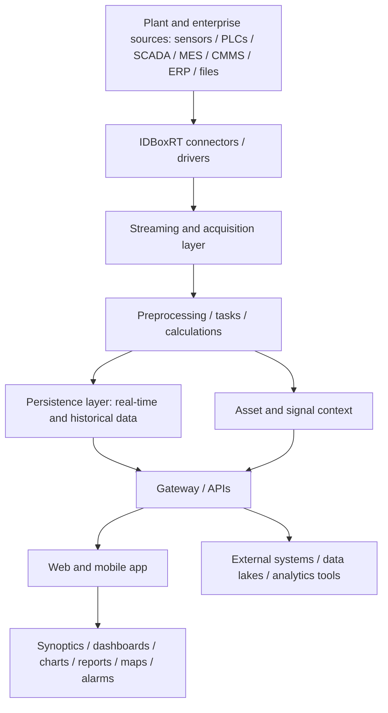

# IDBoxRT

## Executive Summary

IDBoxRT is an operational intelligence and industrial data hub solution for connecting plant, enterprise, and external data sources, preparing data for analysis, and presenting it through dashboards, reports, synoptics, maps, alarms, events, notifications, web/mobile access, and API-style exposure.

Position IDBoxRT when a customer needs to unify heterogeneous industrial data, contextualize it with assets and signals, calculate operational KPIs, and expose usable information to operators, engineers, managers, and external systems. For internal presales use, treat it primarily as a plant data integration and operational visibility layer. Historian-replacement, migration, and AVEVA PI comparison claims remain deferred.

This page is for internal draft use. The top sections are written for sales/presales clarity; the lower sections preserve evidence links, validation notes, open questions, and restricted-content handling.

## Where It Fits

| Fit Area | Presales Guidance | Confidence |
|---|---|---|
| Primary positioning conversation | Operational intelligence, industrial data hub, plant data integration, dashboards/reporting, and cross-system data exposure. | Validated draft |
| Primary audience | Operations, engineering, automation, reliability, IT/OT integration, and business users who need operational data. | Validated draft |
| Data relationship | Connects heterogeneous data sources, preprocesses and contextualizes data, persists selected real-time/historical data, and exposes it to users or third-party systems. | Partially validated |
| IIoT / data platform relationship | Useful as an IIoT-adjacent plant data layer, but broad platform claims should stay within validated scope. | Partially validated |
| Historian relationship | SCADA/historian connector coverage is relevant, but historian replacement is not concluded here. | Still to validate |
| Comparison positioning | Keep IDBoxRT vs AVEVA PI, migration, and historian comparison claims out of this page until a dedicated comparison review. | Still to validate |

## Customer Problems It Addresses

| Customer Problem | How IDBoxRT Helps |
|---|---|
| Plant and enterprise data is fragmented across many systems. | Uses connectors/drivers to acquire information from industrial, SCADA/historian, IoT, enterprise, file, database, API, and service categories. |
| Operational data needs context before it is useful. | Supports asset and signal context, preprocessing, tasks, calculations, and business-rule style preparation. |
| Teams need dashboards, reports, and operational visibility. | Provides user-facing tools such as synoptics, charts, historical views, dashboards, maps, alarms, events, notifications, and reports. |
| Other systems need access to cleaned or transformed data. | Supports gateway/API-style exposure and third-party data exposure paths. |
| Security and user access need administration. | Documentation supports users, roles, permissions, security groups, access groups, sessions, and access-management concepts. |

## What It Does

| Capability Area | Plain-Language Description | Confidence |
|---|---|---|
| Connectors / drivers | Acquires data from industrial systems, SCADA/historians, IoT sources, enterprise systems, databases, files, APIs, and services. | Validated draft |
| Streaming and acquisition | Moves acquired data from connectors into processing components. | Validated draft |
| Preprocessing / tasks | Applies preparation, quality filters, synchronization, resampling, filtering, unit conversion, and related processing before use. | Validated draft |
| Persistence | Supports multiple strategies for real-time and historical data persistence, including recent/older history concepts. | Partially validated |
| Asset and signal context | Organizes signals, assets, templates, groups, and hierarchy concepts for navigation and analysis. | Validated draft |
| Dashboard and reporting tools | Presents data through synoptics, charts, dashboards, reports, maps, alarms, events, and notifications. | Validated draft |
| API / external exposure | Exposes raw or transformed data to third-party systems or external architectures. | Validated draft |

## Validation Status

- Validated draft: operational intelligence / information data hub framing, connector categories, user-facing tools, REST/API exposure, dashboards/reports, assets/signals, and security administration concepts.
- Partially validated: deployment options, persistence strategies, historical storage tiers, Keycloak/LDAP/Active Directory context, and KPI/calculation governance.
- Still to validate: legal vendor identity, production sizing, redundancy, backup/restore, connector limits, API limits, retention scale, product limitations, historian replacement, migration, and comparison conclusions.

## Product Positioning

For presales purposes, treat IDBoxRT as an operational intelligence and industrial data hub. It fits opportunities where the customer needs to connect data from field devices, control systems, operational applications, corporate systems, files, databases, APIs, or external services and turn that data into usable operational information.

Position IDBoxRT around the value of connecting, contextualizing, calculating, visualizing, and exposing industrial data. Keep APM claims, historian replacement claims, migration claims, and AVEVA PI comparison conclusions out of the main story until those topics are separately validated.

## Architecture Overview

IDBoxRT can be explained to customers as a hub between plant/enterprise data sources and the people or systems that need usable operational information. Connectors and drivers acquire data, the acquisition and processing layers prepare it, asset and signal context make it easier to navigate, persistence stores selected real-time or historical data, and web/mobile tools or APIs expose the result.

In a typical discussion, position the architecture as five logical layers: source connectivity, streaming/acquisition, preprocessing and calculations, persistence and context, and user/API access. Detailed deployment topology, sizing, redundancy, storage limits, and operations model should be validated during solution planning.

Diagram caption: This conceptual view shows IDBoxRT collecting heterogeneous plant and enterprise data, processing and contextualizing it, persisting selected data, and exposing it through APIs and user-facing tools. Detailed deployment topology, sizing, redundancy, and operational limits remain implementation validation items.

## Core Components

| Component | Role | Presales Explanation |
|---|---|---|
| Connectors / drivers | Source connectivity | Acquire data from industrial, enterprise, file, service, IoT, database, SCADA/historian, and API-style sources. |
| Streaming and acquisition layer | Data movement | Moves acquired data from source connectors into processing and persistence paths. |
| Processing / tasks | Data preparation | Applies quality filters, synchronization, resampling, filtering, unit conversion, calculations, and business-rule style preparation. |
| Persistence layer | Real-time and historical data handling | Stores or exposes selected real-time and historical data according to configured persistence strategies. |
| Asset and signal context | Operational context | Organizes signals, assets, templates, groups, and hierarchies for navigation and analysis. |
| Gateway / API layer | Data exposure | Exposes raw or transformed data to third-party systems or external architectures. |
| Web and mobile application | User access | Gives users access to IDBoxRT information and tools through web and mobile interfaces. |
| Analysis and presentation tools | Operational visibility | Supports synoptics, charts, diagrams, historical views, dashboards, reports, maps, alarms, events, and notifications. |

## Integration Notes

IDBoxRT integration discussions can span field equipment, control systems, SCADA, historians, MES, CMMS, LIMS, ERP, databases, files, APIs, IoT messaging, and external services. Use that breadth to frame discovery, not to guarantee fit for a specific project.

For customer planning, validate the exact source systems, connector versions, protocol requirements, data direction, API limits, authorization model, and responsibility boundaries. Historian connectors validate integration relevance; they do not by themselves prove historian replacement.

## Deployment Notes

For presales purposes, describe IDBoxRT deployment as an industrial data platform that may involve containerized/platform components, persistence layers, access-control services, and web/mobile access. Keep deployment options at planning level until the customer environment and deployment documents are reviewed.

Before solution design, validate hosting model, infrastructure sizing, redundancy, network zones, backup/restore, operating responsibility, retention approach, storage tiers, access-control integration, and production support model.

## Typical Use Cases

| Use Case | Presales Description |
|---|---|
| Plant operations visibility | Provide real-time and historical visibility across plant data sources. |
| Industrial data consolidation | Collect, contextualize, and prepare heterogeneous data for analysis and downstream systems. |
| Operational KPI calculation | Build calculations and business rules from operational signals and contextual data. |
| Dashboards and reporting | Present operational information through dashboards, reports, charts, synoptics, maps, alarms, events, and notifications. |
| Integration layer for industrial systems | Connect industrial, SCADA/historian, IoT, corporate, file, database, API, and external-service sources. |
| Historian-adjacent data enablement | Support historian-connected data workflows while leaving replacement or migration conclusions for later validation. |

Case-study benefits and quantified outcomes remain deferred until selected primary case-study sources are reviewed. Non-pricing benefits may be included later only when reviewed.

## Presales Qualification Notes

- Position IDBoxRT when the customer needs an operational data hub, industrial data integration layer, KPI/calculation layer, dashboard/reporting layer, or API-style exposure of plant data.
- Confirm whether the need is data consolidation, real-time visibility, historical analysis, dashboarding, reporting, integration, or historian-adjacent data enablement.
- Ask which industrial systems, SCADA/historians, enterprise applications, databases, files, APIs, and IoT sources are in scope.
- Keep historian replacement, migration, and AVEVA PI comparison claims deferred until the dedicated validation documents and comparison pages are reviewed.
- Treat detailed deployment, sizing, redundancy, access control, API limits, data retention, and product limitations as validation topics.

## What To Validate With Customer

- Which source systems and connector categories are mandatory?
- Which data must be persisted, calculated, exposed live, or sent to external systems?
- What dashboard, synoptic, report, map, alarm, event, notification, and mobile workflows are required?
- What user roles, security groups, permissions, access groups, and directory integrations are required?
- What production deployment model, infrastructure, redundancy, backup/restore, and network-zone constraints apply?
- Is the customer asking for a historian, a historian complement, or a historian replacement? Keep the answer open until dedicated comparison review.

## Evidence Sources

| Source ID | Title | Link | Evidence Role | Review Status |
|---|---|---|---|---|
| `SRC-APM-IIOT-0001` | AVENUE APM & IIoT Solutions | [Open source](<https://docs.google.com/spreadsheets/d/1OKfe48zNwTjB1196QU45f8jqNyT8OyszAwLQ-D1gdEw>) | Initial Batch 1 portfolio-level draft context | Draft extracted |
| `SRC-APM-IIOT-0011` | IDBoxRT source folder | [Open source](<https://drive.google.com/drive/folders/17Q2yiUSr7GmIlhvRyclGZ4whhPsezzov>) | Parent IDBoxRT source folder | Batch 1.10 document audit completed |
| `SRC-IDBOXRT-DOC-0001` | IDboxRT description and technical architecture.docx | [Open source](<https://docs.google.com/document/d/1qD_TuIVzKLma3pB2uTAlhl-BufEfQDX7/edit?usp=drivesdk&ouid=108564093758567510758&rtpof=true&sd=true>) | Primary reviewed source for positioning, architecture, modules, connectors, contextualization, persistence, API, and KPI model | In progress |
| `SRC-IDBOXRT-DOC-0002` | IDboxRT documentation.pdf | [Open source](<https://drive.google.com/file/d/1fL2X0yelmvvhNWQHTYDFae-AedkAFtYc/view?usp=drivesdk>) | Primary reviewed source for user-facing modules, administration, security, data acquisition, signals, assets, dashboards, reports, alarms, events, and sessions | In progress |
| `SRC-IDBOXRT-DOC-0003` | IDbox User Manual.pdf | [Open source](<https://drive.google.com/file/d/1MSLnC2M6eqyk44kCUwGTDAtJmXcUFV5r/view?usp=drivesdk>) | Optional future validation source for detailed user workflows | Not started |
| `SRC-IDBOXRT-DOC-0004` | IDboxRT connectors.pdf | [Open source](<https://drive.google.com/file/d/1kzn0dCMwvGUXCQROvTQKhcWDliPHPlb9/view?usp=drivesdk>) | Primary reviewed source for connector categories, supported protocols, SCADA/historian connectors, IoT connectors, and enterprise/service connectors | In progress |
| `SRC-IDBOXRT-DOC-0005` | IDBoxRT General Presentation - 06.05.2024.pptx | [Open source](<https://docs.google.com/presentation/d/1Wre2K4U0KW_Dfol5K4uYt98LrofP582y/edit?usp=drivesdk&ouid=108564093758567510758&rtpof=true&sd=true>) | Future validation target for product positioning, vendor context, capabilities overview, and use cases; review for sales/commercial language | Not started |
| `SRC-IDBOXRT-DOC-0006` | Dashboards.pdf | [Open source](<https://drive.google.com/file/d/1JA_SUw5kvNbZjC_3q1nSABbXn6Vcvu4X/view?usp=drivesdk>) | Future validation target for dashboard and reporting capabilities | Not started |
| `SRC-IDBOXRT-DOC-0007` | IDboxRT synoptic examples.pdf | [Open source](<https://drive.google.com/file/d/15rxUqy_C_hhIWCSRrVbk41dg1V8cKyai/view?usp=drivesdk>) | Future validation target for visualization and operator UI examples; do not copy screenshots into wiki without review | Not started |
| `SRC-IDBOXRT-DOC-0008` | IDboxRT mobile app EN.pdf | [Open source](<https://drive.google.com/file/d/1PQoxtN1D7YpeqJb3HYTnHqMp51kJlKlt/view?usp=drivesdk>) | Future validation target for mobile access, workflows, and security implications | Not started |
| `SRC-IDBOXRT-DOC-0009` | Installation Review - Avenue.docx | [Open source](<https://docs.google.com/document/d/1pksaaUjO4mrTcxFfNnxwUMbVskhQeZPi/edit?usp=drivesdk&ouid=108564093758567510758&rtpof=true&sd=true>) | Future validation target for deployment and infrastructure; review for project-specific or restricted context | Not started |
| `SRC-IDBOXRT-DOC-0010` | Guía Instalación IDbox 3 en Windows desde Cero (IDboxRT)_en.pdf | [Open source](<https://drive.google.com/file/d/1kTDMXa66k8F6cIP4jdAjKRR4A8y9hspp/view?usp=drivesdk>) | Future validation target for deployment model, installation, system requirements, and limitations | Not started |
| `SRC-IDBOXRT-DOC-0011` | Guía Instalación Keycloak en Windows (IDboxRT)_en.pdf | [Open source](<https://drive.google.com/file/d/170zRcfOEfaiaQ-riMYBfH-zNJ3OIDuN4/view?usp=drivesdk>) | Future validation target for access-control and authentication-adjacent deployment details | Not started |
| `SRC-IDBOXRT-DOC-0012` | IDBoxRT as new Historian Solution for Power Generation Customers.docx | [Open source](<https://docs.google.com/document/d/1ihZ2ItXGpEYD9kQA-zOKJiAOMVjfbdPn/edit?usp=drivesdk&ouid=108564093758567510758&rtpof=true&sd=true>) | Future validation target for historian positioning and assumptions; no comparison conclusions in this batch | Not started |
| `SRC-IDBOXRT-DOC-0013` | IDboxRT migration pathv2.pdf | [Open source](<https://drive.google.com/file/d/1AJk6ujx-CgxNHpbj4DvQ5eoWFzdlIvEn/view?usp=drivesdk>) | Future validation target for migration and coexistence questions; no comparison conclusions in this batch | Not started |
| `SRC-IDBOXRT-EXTRACT-0001` | 01_IDBoxRT Extracted Keys.md | [Open source](<https://drive.google.com/file/d/1YNaeMQ3JkAxYN0uf4KNPO1ZrydBY9Mz4/view?usp=drivesdk>) | Derived review aid only; candidate capability and tender topic discovery | Not evidence for final claims |
| `SRC-IDBOXRT-EXTRACT-0002` | 02_IDBoxRT Business Section.md | [Open source](<https://drive.google.com/file/d/1h__UK28RSeJDhj6IMiRl2AmK63UUt6XM/view?usp=drivesdk>) | Derived review aid only; candidate business and use-case framing | Not evidence for final claims |
| `SRC-IDBOXRT-EXTRACT-0003` | 03_IDBoxRT Technical Section.md | [Open source](<https://drive.google.com/file/d/1a6_NerCFHyrFX-wbgrFr_rCwrVdSJ9aL/view?usp=drivesdk>) | Derived review aid only; candidate architecture and integration checklist support | Not evidence for final claims |
| `SRC-IDBOXRT-EXTRACT-0004` | 04_IDBoxRT Use cases, Deployment and BOM.md | No wiki evidence link; restricted pricing-risk source | Excluded from wiki enrichment except to identify restricted content | Restricted / not used |

## Source-Backed Draft Notes

### Source Coverage

| Source ID | Source Title | Extraction Status | Notes |
|---|---|---|---|
| `SRC-APM-IIOT-0001` | AVENUE APM & IIoT Solutions | Batch 1 draft extracted | Main source used for the initial IDBoxRT draft extraction batch; reference URLs in the sheet were treated only as supporting references. |
| `SRC-APM-IIOT-0011` | IDBoxRT | Batch 1.10 document audit completed | Registered source folder exists; document-level source candidates have been identified. |
| `SRC-IDBOXRT-DOC-0001` | IDboxRT description and technical architecture.docx | Batch 1.11 validation in progress | Reviewed for product positioning, architecture, acquisition, processing, persistence, API, dashboard/reporting, and product-boundary notes. |
| `SRC-IDBOXRT-DOC-0002` | IDboxRT documentation.pdf | Batch 1.11 validation in progress | Reviewed for user-facing modules, administration, security concepts, acquisition administration, signals, assets, dashboards, reports, alarms, events, and sessions. |
| `SRC-IDBOXRT-DOC-0004` | IDboxRT connectors.pdf | Batch 1.11 validation in progress | Reviewed for connector categories, protocol examples, SCADA/historian connectors, IoT connectors, and enterprise/service connectors. |
| `SRC-IDBOXRT-EXTRACT-0001` to `SRC-IDBOXRT-EXTRACT-0003` | IDBoxRT NotebookLM markdown summaries | Review aids only | Used only for organizing candidate review topics; not treated as primary evidence. |

### Draft Facts from Source

| Topic | Draft Note | Evidence Source | Review Status |
|---|---|---|---|
| General concept | IDBoxRT is an operational intelligence platform and information data hub for integrating, processing, analyzing, and visualizing historical and real-time data. | `SRC-IDBOXRT-DOC-0001` | Refined by source |
| Vendor | The Batch 1 source sheet lists CIC Consulting Informatico from Spain as the vendor. The selected primary documents support CIC involvement, but legal vendor identity and current ownership still need human confirmation. | `SRC-APM-IIOT-0001`, `SRC-IDBOXRT-DOC-0001` | Partially supported |
| Problems solved | IDBoxRT is positioned around sharing information automatically across industrial systems, reducing response time, reducing errors, and making data available for operational decision support. | `SRC-IDBOXRT-DOC-0001` | Refined by source |
| Core capabilities | Selected sources support data acquisition, connector-based integration, preprocessing, persistence strategies, asset/signal context, calculations, dashboards, synoptics, charts, reports, maps, alarms, notifications, and API exposure. | `SRC-IDBOXRT-DOC-0001`, `SRC-IDBOXRT-DOC-0002`, `SRC-IDBOXRT-DOC-0004` | Refined by source |
| Typical use cases | Current sources support operational visibility, industrial data consolidation, calculation/KPI workflows, reporting/dashboarding, and integration-layer use cases. | `SRC-IDBOXRT-DOC-0001`, `SRC-IDBOXRT-DOC-0002`, `SRC-IDBOXRT-DOC-0004` | Refined by source |
| Integration relevance | Selected sources support field, control, operational, corporate, SCADA/historian, IoT, database, file, and API integration categories. | `SRC-IDBOXRT-DOC-0001`, `SRC-IDBOXRT-DOC-0004` | Validated by source |
| Deployment model | Deployment and persistence strategies are partially supported, but full deployment topology, sizing, redundancy, backup/restore, and operations model need additional validation. | `SRC-IDBOXRT-DOC-0001`, `SRC-IDBOXRT-DOC-0002` | Partially supported |
| APM / IIoT / historian positioning | IDBoxRT is better described here as an IIoT / operational intelligence / industrial data hub. Historian replacement and APM positioning require later source review. | `SRC-IDBOXRT-DOC-0001`, `SRC-IDBOXRT-DOC-0004` | Partially supported |

## Document-Level Validation Notes

### Document Coverage

| Source ID | Document Title | Validation Role | Extraction Status |
|---|---|---|---|
| `SRC-IDBOXRT-DOC-0001` | IDboxRT description and technical architecture.docx | Primary reviewed source for architecture, data hub framing, components, acquisition, processing, persistence, API exposure, and product boundaries. | In progress |
| `SRC-IDBOXRT-DOC-0004` | IDboxRT connectors.pdf | Primary reviewed source for supported connector categories and representative protocol/system connectors. | In progress |
| `SRC-IDBOXRT-DOC-0002` | IDboxRT documentation.pdf | Primary reviewed source for functional modules, security administration concepts, signals, assets, dashboards, reports, events, alarms, notifications, and sessions. | In progress |
| `SRC-IDBOXRT-DOC-0003` | IDbox User Manual.pdf | Optional supporting source for future detailed workflow validation; not reviewed in this batch. | Not started |

### Validated / Refined Draft Facts

| Topic | Batch 1 Draft Note | Validation Result | Evidence Source | Review Status |
|---|---|---|---|---|
| Official product positioning | Batch 1 treated IDBoxRT as an operational intelligence / industrial data hub candidate. | Refined by source: selected primary evidence supports operational intelligence and information data hub framing. | `SRC-IDBOXRT-DOC-0001` | Refined by source |
| Architecture and major modules | Batch 1 architecture was conceptual. | Refined by source: page now identifies connectors/drivers, streaming/acquisition, processing/tasks, persistence, asset context, gateway/API, web/mobile app, and user-facing tools. | `SRC-IDBOXRT-DOC-0001`, `SRC-IDBOXRT-DOC-0002` | Refined by source |
| Supported data sources/connectors | Batch 1 said heterogeneous data collection. | Validated by source: selected documents support industrial, SCADA/historian, IoT, enterprise, file, database, API, and service connector categories. | `SRC-IDBOXRT-DOC-0001`, `SRC-IDBOXRT-DOC-0004` | Validated by source |
| Protocol/API/interface support | Batch 1 kept protocol/API support open. | Refined by source: page now includes representative industrial protocol categories, SCADA/historian connectors, IoT connectors, enterprise/service connectors, and REST API exposure. | `SRC-IDBOXRT-DOC-0001`, `SRC-IDBOXRT-DOC-0004` | Refined by source |
| SCADA/historian relationship | Batch 1 listed SCADA/Historian-layer relevance. | Partially supported: connectors validate SCADA/historian integration relevance, but historian replacement conclusions are not made. | `SRC-IDBOXRT-DOC-0001`, `SRC-IDBOXRT-DOC-0004` | Partially supported |
| Data storage and retention | Batch 1 did not validate storage. | Refined by source: page now documents persistence strategies, latest-sample storage, historical storage, and tiered history concepts at a draft level. | `SRC-IDBOXRT-DOC-0001` | Refined by source |
| Contextualization/preprocessing | Batch 1 listed contextualization and preprocessing. | Refined by source: selected evidence supports asset/signal context and preprocessing tasks such as data preparation, quality filters, synchronization, resampling, re-propagation, filtering, and unit conversion. | `SRC-IDBOXRT-DOC-0001`, `SRC-IDBOXRT-DOC-0002` | Refined by source |
| KPI/calculation model | Batch 1 listed KPI calculation. | Partially supported: selected sources support calculation functions, business rules, and diagram/function tools, but detailed KPI governance still needs validation. | `SRC-IDBOXRT-DOC-0001`, `SRC-IDBOXRT-DOC-0002` | Partially supported |
| Dashboard/reporting capabilities | Batch 1 listed interactive reporting. | Validated by source: selected sources support dashboards, reports, charts, synoptics, maps, alarms, events, and notifications. | `SRC-IDBOXRT-DOC-0001`, `SRC-IDBOXRT-DOC-0002` | Validated by source |
| Deployment model | Batch 1 listed on-premises, cloud, and hybrid as candidates. | Partially supported: selected evidence mentions cloud/customer-premises virtual-machine/mixed contexts and deployment architecture components, but detailed deployment model still needs deployment-source validation. | `SRC-IDBOXRT-DOC-0001` | Partially supported |
| Security/access control | Batch 1 did not validate security. | Refined by source: selected evidence supports security groups, users, roles, permissions, access groups, sessions, Keycloak context, and LDAP/Active Directory synchronization. | `SRC-IDBOXRT-DOC-0001`, `SRC-IDBOXRT-DOC-0002` | Refined by source |
| Limitations and product boundaries | Batch 1 kept limits open. | Still to validate: selected sources support capabilities but do not provide enough neutral limitation detail for final product-boundary claims. | `SRC-IDBOXRT-DOC-0001`, `SRC-IDBOXRT-DOC-0002`, `SRC-IDBOXRT-DOC-0004` | Still to validate |
| Pricing/commercial content | Batch 1 required exclusion. | Excluded from wiki: commercial sections and pricing-risk derived sources remain out of scope. | N/A | Excluded from wiki |

## Open Questions

- Which current vendor/legal identity and product ownership details should be used after human review?
- Which deployment source should confirm sizing, redundancy, backup/restore, network zones, and production operations model?
- Which IDBoxRT limits should be documented for retention, scale, connector behavior, API throughput, and enterprise reporting?
- Which calculation/KPI governance rules should be documented for production use?
- Which security details should be separated into product facts versus customer-specific implementation design?
- Does IDBoxRT store historian-grade time-series data, complement existing historians, or replace some historian use cases in specific contexts? Keep this open until the historian-positioning and migration documents are reviewed.
- Which comparison claims belong in `idboxrt-vs-historian.md` only after a later comparison batch?
- Which claims from the NotebookLM-derived files can be validated against original IDBoxRT source documents?

## Excluded Content

- Pricing, licensing, discounts, commercial quotes, proposal prices, budgetary prices, BOM prices, service fees, support fees, training fees, and commercial terms are excluded from this wiki page.
- `SRC-IDBOXRT-EXTRACT-0004` is a high-pricing-risk derived source and was not used for wiki enrichment.
- Connector names or external-service references that imply commercial market-price data are excluded from this page.
- IDBoxRT vs AVEVA PI, historian replacement, and migration-path conclusions are excluded from this batch.
- Case-study claims and quantified benefits remain deferred until selected primary case-study sources are reviewed and commercial content is excluded.
- NotebookLM-derived content is not treated as approved knowledge and cannot independently support wiki claims.

## Related Capability Pages

- [IIoT Platform](../capabilities/iiot-platform)
- [Industrial Historian](../capabilities/industrial-historian)
- [Asset Performance Management](../capabilities/apm)

## Related Pattern Pages

- [Edge to Center](../patterns/edge-to-center)
- [OPC UA Integration](../patterns/opc-ua-integration)
- [MQTT Sparkplug](../patterns/mqtt-sparkplug)
- [SCADA/DCS Data Ingestion](../patterns/scada-dcs-data-ingestion)

## Review Notes

- Keep this page `draft`, `private`, and `confidence: low` until product document review and human review are complete.
- Keep historian replacement, migration, and IDBoxRT vs AVEVA PI comparison conclusions deferred.
- Keep pricing, licensing, BOM, and restricted commercial notes outside this page.
