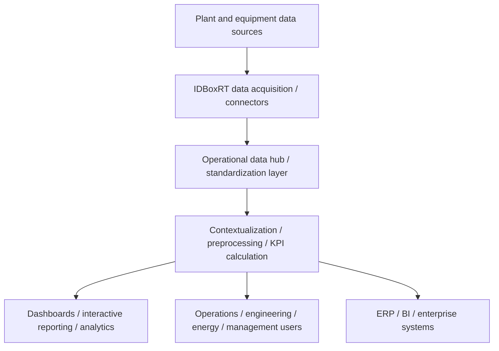

# IDBoxRT

## Executive Summary

IDBoxRT is a draft IIoT and operational intelligence solution page for industrial data consolidation, monitoring, and reporting use cases. The Batch 1 source sheet positions IDBoxRT as a real-time operational data monitoring and analysis platform, with candidate capability areas around heterogeneous data collection, operational data standardization, signal contextualization, preprocessing, KPI calculation, and interactive reporting. Evidence: `SRC-APM-IIOT-0001`. Review status: draft, pending validation against IDBoxRT product documents.

In this wiki, IDBoxRT is most useful as a candidate industrial data hub or IIoT platform layer for plant operations visibility, energy and asset data consolidation, operational KPI calculation, and tender requirement mapping. The registered IDBoxRT source folder and NotebookLM-derived summaries are available for review, but document-level product sources have not yet been validated. Evidence: `SRC-APM-IIOT-0001`; validation target: `SRC-APM-IIOT-0011`.

## Scope

- In scope:
  - IDBoxRT as a candidate IIoT, operational intelligence, or industrial data platform solution.
  - Draft mapping against industrial data collection, contextualization, KPI, reporting, and integration needs.
  - Source-backed notes for future manual validation and tender preparation.
  - Open questions for later IDBoxRT document audit and product validation.
- Out of scope:
  - final vendor claims before product document review;
  - pricing, licensing, BOM, quote, fee, discount, or commercial terms;
  - public marketing content;
  - unsupported historian replacement claims;
  - detailed architecture, protocol, deployment, or limitation claims that have not been validated.

## Product Positioning

| Positioning Area | Draft Position | Evidence | Review Status |
|---|---|---|---|
| IIoT / operational intelligence platform | IDBoxRT should be treated as a candidate IIoT and operational intelligence platform based on the Batch 1 sheet framing. | `SRC-APM-IIOT-0001` | Draft, pending validation |
| Industrial data hub / plant data layer | The page uses "industrial data hub" as a conservative wiki positioning for data consolidation, standardization, contextualization, KPI calculation, and reporting. | `SRC-APM-IIOT-0001` | Draft, pending validation |
| Relationship to SCADA / historian layers | The Batch 1 sheet frames IDBoxRT around ISA-95-style integration across field devices, SCADA/Historian layers, and ERP/BI layers. Exact interfaces and product boundaries remain unresolved. | `SRC-APM-IIOT-0001` | Still to validate |
| Relationship to dashboards and analytics | Interactive reporting and KPI calculation are candidate capability areas. Specific dashboard, analytics, and visualization modules remain to validate against product documents. | `SRC-APM-IIOT-0001`; `SRC-IDBOXRT-EXTRACT-0003` as review aid only | Partially supported |
| Relationship to APM / historian | IDBoxRT should not yet be described as an APM platform or an approved historian replacement. Treat it as an IIoT / operational intelligence data layer until primary product evidence is reviewed. | `SRC-APM-IIOT-0001` | Conservative boundary note |
| What remains to validate | Official product architecture, module names, supported protocols, deployment model, security model, limitations, and historian boundaries require product source review. | `SRC-APM-IIOT-0011` | Still to validate |

## Architecture Overview

The current draft architecture treats IDBoxRT as a plant data layer that may collect data from industrial sources, standardize and contextualize operational signals, calculate KPIs, and expose information through reporting, dashboards, or enterprise integration paths. This diagram is conceptual and based on `SRC-APM-IIOT-0001`; it is not yet a validated product architecture.

Diagram evidence: `SRC-APM-IIOT-0001`. Review status: conceptual draft. Product component names, supported source systems, connector details, edge or central deployment patterns, and external-system interfaces remain `Still to validate`.

## Core Components

| Component | Role | Candidate Capabilities | Evidence | Review Status |
|---|---|---|---|---|
| Data acquisition / connectors | Candidate intake layer for plant, equipment, production, and operational data. | Heterogeneous data collection is listed as a candidate capability. Supported connectors, protocols, and collection methods remain to validate. | `SRC-APM-IIOT-0001`; `SRC-IDBOXRT-EXTRACT-0003` as review aid only | Draft, pending validation |
| Operational data hub / standardization layer | Candidate layer for consolidating and normalizing operational information. | Operational data standardization and consolidation across equipment, production, and plant levels are Batch 1 draft themes. | `SRC-APM-IIOT-0001` | Draft, pending validation |
| Contextualization / preprocessing | Candidate layer for preparing operational signals for use in dashboards, KPIs, and analysis. | Signal contextualization and preprocessing are listed as candidate capability areas. | `SRC-APM-IIOT-0001`; `SRC-IDBOXRT-EXTRACT-0003` as review aid only | Draft, pending validation |
| KPI calculation | Candidate calculation layer for operational indicators. | KPI calculation is listed as a candidate capability area. Calculation model, scheduling, formula governance, and limits remain to validate. | `SRC-APM-IIOT-0001` | Draft, pending validation |
| Dashboards / interactive reporting | Candidate user-facing layer for operational visibility. | Interactive reporting is listed as a candidate capability area. Official module names and visualization boundaries remain to validate. | `SRC-APM-IIOT-0001`; `SRC-IDBOXRT-EXTRACT-0002` as review aid only | Draft, pending validation |
| Enterprise integration layer | Candidate connection layer to business intelligence or enterprise systems. | The Batch 1 sheet frames IDBoxRT around integration between field, SCADA/Historian, and ERP/BI layers. Specific interfaces remain unresolved. | `SRC-APM-IIOT-0001` | Still to validate |

## Integration Notes

| Integration Area | Draft Note | Evidence | Review Status |
|---|---|---|---|
| Field and equipment data | IDBoxRT is a candidate for collecting and consolidating equipment-level and plant-level operational data. | `SRC-APM-IIOT-0001` | Draft, pending validation |
| SCADA / historian layer | The Batch 1 sheet references SCADA/Historian-layer relevance, but the page should not list specific integrations until IDBoxRT documents validate them. | `SRC-APM-IIOT-0001` | Still to validate |
| ERP / BI layer | ERP and BI integration are useful review categories based on the source sheet, but supported interfaces and data flows remain unresolved. | `SRC-APM-IIOT-0001` | Still to validate |
| Energy, asset, and production data consolidation | The source sheet associates IDBoxRT with energy data silos and consolidation across operational levels. | `SRC-APM-IIOT-0001` | Draft, pending validation |
| Protocol and API support | No protocol or API list is approved on this page yet. Keep protocol claims in open questions until primary documents are reviewed. | `SRC-APM-IIOT-0011` | Still to validate |
| External application enablement | Derived review aids may help identify candidate application enablement topics, but they do not independently support wiki claims. | `SRC-IDBOXRT-EXTRACT-0001`, `SRC-IDBOXRT-EXTRACT-0003` as review aids only | Still to validate |

Do not add protocol lists, named connector claims, API claims, historian migration claims, or IDBoxRT-vs-historian conclusions until product-specific primary sources are reviewed.

## Deployment Notes

| Topic | Draft Note | Evidence | Review Status |
|---|---|---|---|
| On-premises deployment | The Batch 1 sheet lists on-premises deployment as a candidate model. Architecture, sizing, and operational responsibility remain unresolved. | `SRC-APM-IIOT-0001` | Still to validate |
| Cloud deployment | The Batch 1 sheet lists cloud deployment as a candidate model. Hosting boundary, security model, and ownership assumptions remain unresolved. | `SRC-APM-IIOT-0001` | Still to validate |
| Hybrid deployment | The Batch 1 sheet lists hybrid deployment as a candidate model. Local-to-central topology, synchronization, and network-zone design remain unresolved. | `SRC-APM-IIOT-0001` | Still to validate |
| Edge-to-center pattern | Edge-to-center architecture may be relevant to future review, but this page does not yet validate edge components, buffering, or store-and-forward behavior. | `SRC-IDBOXRT-EXTRACT-0003` as review aid only | Still to validate |
| Infrastructure requirements | Hardware sizing, network requirements, redundancy, backup/restore, user management, and cybersecurity controls are not validated yet. | `SRC-APM-IIOT-0011` | Still to validate |

## Typical Use Cases

| Use Case | Draft Note | Evidence | Review Status |
|---|---|---|---|
| Plant operations visibility | Use IDBoxRT as a candidate data layer for plant-level operational visibility and monitoring workflows. | `SRC-APM-IIOT-0001` | Draft, pending validation |
| Energy and asset data consolidation | Use IDBoxRT as a candidate platform for consolidating energy, asset, and operational data silos. | `SRC-APM-IIOT-0001` | Draft, pending validation |
| Operational KPI calculation | Use IDBoxRT as a candidate platform for deriving operational KPIs from standardized and contextualized data. | `SRC-APM-IIOT-0001` | Draft, pending validation |
| Interactive reporting | Use IDBoxRT as a candidate reporting layer for operations, engineering, energy, or management users. | `SRC-APM-IIOT-0001` | Draft, pending validation |
| Tender IIoT requirements | Use IDBoxRT as a candidate reference when mapping data collection, contextualization, dashboard, and integration requirements. | `SRC-APM-IIOT-0001`; `SRC-APM-IIOT-0011` | Draft planning use |
| Historian-adjacent data enablement | Evaluate IDBoxRT for historian-adjacent data enablement only after product documents clarify whether it complements, consumes from, or overlaps historian systems. | `SRC-APM-IIOT-0001` | Still to validate |

Industry-specific case studies and quantified benefits remain deferred until selected primary case-study documents are reviewed. Non-pricing benefits may be included later only if source-backed and reviewed.

## Evidence Sources

| Source ID | Title | Link | Evidence Role | Review Status |
|---|---|---|---|---|
| `SRC-APM-IIOT-0001` | AVENUE APM & IIoT Solutions | [Open source](<https://docs.google.com/spreadsheets/d/1OKfe48zNwTjB1196QU45f8jqNyT8OyszAwLQ-D1gdEw>) | Initial Batch 1 portfolio-level draft context and current source-backed facts | Draft extracted |
| `SRC-APM-IIOT-0011` | IDBoxRT source folder | [Open source](<https://drive.google.com/drive/folders/17Q2yiUSr7GmIlhvRyclGZ4whhPsezzov>) | Parent IDBoxRT source folder and future validation target | Batch 1.10 document audit completed |
| `SRC-IDBOXRT-DOC-0001` | IDboxRT description and technical architecture.docx | [Open source](<https://docs.google.com/document/d/1qD_TuIVzKLma3pB2uTAlhl-BufEfQDX7/edit?usp=drivesdk&ouid=108564093758567510758&rtpof=true&sd=true>) | Primary validation target for product positioning, architecture, modules, connectors, contextualization, and KPI model | Not started |
| `SRC-IDBOXRT-DOC-0002` | IDboxRT documentation.pdf | [Open source](<https://drive.google.com/file/d/1fL2X0yelmvvhNWQHTYDFae-AedkAFtYc/view?usp=drivesdk>) | Primary validation target for documentation, deployment, storage, security, connectors, and limitations | Not started |
| `SRC-IDBOXRT-DOC-0003` | IDbox User Manual.pdf | [Open source](<https://drive.google.com/file/d/1MSLnC2M6eqyk44kCUwGTDAtJmXcUFV5r/view?usp=drivesdk>) | Primary validation target for functional capabilities, user workflows, dashboards, and access control | Not started |
| `SRC-IDBOXRT-DOC-0004` | IDboxRT connectors.pdf | [Open source](<https://drive.google.com/file/d/1kzn0dCMwvGUXCQROvTQKhcWDliPHPlb9/view?usp=drivesdk>) | Primary validation target for supported data sources, connectors, protocols, APIs, and SCADA/historian relationship | Not started |
| `SRC-IDBOXRT-DOC-0005` | IDBoxRT General Presentation - 06.05.2024.pptx | [Open source](<https://docs.google.com/presentation/d/1Wre2K4U0KW_Dfol5K4uYt98LrofP582y/edit?usp=drivesdk&ouid=108564093758567510758&rtpof=true&sd=true>) | Future validation target for product positioning, vendor context, capabilities overview, and use cases; review for sales/commercial language | Not started |
| `SRC-IDBOXRT-DOC-0006` | Dashboards.pdf | [Open source](<https://drive.google.com/file/d/1JA_SUw5kvNbZjC_3q1nSABbXn6Vcvu4X/view?usp=drivesdk>) | Future validation target for dashboard and reporting capabilities | Not started |
| `SRC-IDBOXRT-DOC-0007` | IDboxRT synoptic examples.pdf | [Open source](<https://drive.google.com/file/d/15rxUqy_C_hhIWCSRrVbk41dg1V8cKyai/view?usp=drivesdk>) | Future validation target for visualization and operator UI examples; do not copy screenshots into wiki without review | Not started |
| `SRC-IDBOXRT-DOC-0008` | IDboxRT mobile app EN.pdf | [Open source](<https://drive.google.com/file/d/1PQoxtN1D7YpeqJb3HYTnHqMp51kJlKlt/view?usp=drivesdk>) | Future validation target for mobile access, workflows, and security implications | Not started |
| `SRC-IDBOXRT-DOC-0009` | Installation Review - Avenue.docx | [Open source](<https://docs.google.com/document/d/1pksaaUjO4mrTcxFfNnxwUMbVskhQeZPi/edit?usp=drivesdk&ouid=108564093758567510758&rtpof=true&sd=true>) | Future validation target for deployment and infrastructure; review for project-specific or restricted context | Not started |
| `SRC-IDBOXRT-DOC-0010` | Guía Instalación IDbox 3 en Windows desde Cero (IDboxRT)_en.pdf | [Open source](<https://drive.google.com/file/d/1kTDMXa66k8F6cIP4jdAjKRR4A8y9hspp/view?usp=drivesdk>) | Future validation target for deployment model, installation, system requirements, and limitations | Not started |
| `SRC-IDBOXRT-DOC-0011` | Guía Instalación Keycloak en Windows (IDboxRT)_en.pdf | [Open source](<https://drive.google.com/file/d/170zRcfOEfaiaQ-riMYBfH-zNJ3OIDuN4/view?usp=drivesdk>) | Future validation target for access-control and authentication-adjacent deployment details | Not started |
| `SRC-IDBOXRT-DOC-0012` | IDBoxRT as new Historian Solution for Power Generation Customers.docx | [Open source](<https://docs.google.com/document/d/1ihZ2ItXGpEYD9kQA-zOKJiAOMVjfbdPn/edit?usp=drivesdk&ouid=108564093758567510758&rtpof=true&sd=true>) | Future validation target for historian positioning and assumptions; no comparison conclusions in this batch | Not started |
| `SRC-IDBOXRT-DOC-0013` | IDboxRT migration pathv2.pdf | [Open source](<https://drive.google.com/file/d/1AJk6ujx-CgxNHpbj4DvQ5eoWFzdlIvEn/view?usp=drivesdk>) | Future validation target for migration and coexistence questions; no comparison conclusions in this batch | Not started |
| `SRC-IDBOXRT-EXTRACT-0001` | 01_IDBoxRT Extracted Keys.md | [Open source](<https://drive.google.com/file/d/1YNaeMQ3JkAxYN0uf4KNPO1ZrydBY9Mz4/view?usp=drivesdk>) | Derived review aid only; candidate capability and tender topic discovery | Not evidence for final claims |
| `SRC-IDBOXRT-EXTRACT-0002` | 02_IDBoxRT Business Section.md | [Open source](<https://drive.google.com/file/d/1h__UK28RSeJDhj6IMiRl2AmK63UUt6XM/view?usp=drivesdk>) | Derived review aid only; candidate business and use-case framing | Not evidence for final claims |
| `SRC-IDBOXRT-EXTRACT-0003` | 03_IDBoxRT Technical Section.md | [Open source](<https://drive.google.com/file/d/1a6_NerCFHyrFX-wbgrFr_rCwrVdSJ9aL/view?usp=drivesdk>) | Derived review aid only; candidate architecture and integration checklist support | Not evidence for final claims |
| `SRC-IDBOXRT-EXTRACT-0004` | 04_IDBoxRT Use cases, Deployment and BOM.md | No wiki evidence link; restricted pricing-risk source | Excluded from wiki enrichment except to identify restricted content | Restricted / not used |

## Source-Backed Draft Notes

### Source Coverage

| Source ID | Source Title | Extraction Status | Notes |
|---|---|---|---|
| `SRC-APM-IIOT-0001` | AVENUE APM & IIoT Solutions | Batch 1 draft extracted | Main source used for the initial IDBoxRT draft extraction batch; reference URLs in the sheet were treated only as supporting references. |
| `SRC-APM-IIOT-0011` | IDBoxRT | Batch 1.10 document audit completed | Registered source folder exists; document-level source candidates have been identified and still need validation before stronger claims are added. |
| `SRC-IDBOXRT-EXTRACT-0001` to `SRC-IDBOXRT-EXTRACT-0003` | IDBoxRT NotebookLM markdown summaries | Review aids only | Used only for organizing candidate review topics; not treated as primary evidence. |

### Draft Facts from Source

| Topic | Draft Note | Evidence Source | Review Status |
|---|---|---|---|
| General concept | The source sheet positions IDBoxRT as a real-time operational data monitoring and analysis platform, described as an Operational Intelligence and information data hub layer. | `SRC-APM-IIOT-0001` | Draft, pending validation |
| Vendor | The source sheet lists CIC Consulting Informatico from Spain as the vendor. Legal vendor identity, current product ownership, and naming should still be validated against product documents. | `SRC-APM-IIOT-0001` | Still to validate |
| Problems solved | The source sheet associates IDBoxRT with fragmented operational data, energy data silos, and difficulty consolidating information from equipment, production, and plant levels. | `SRC-APM-IIOT-0001` | Draft, pending validation |
| Core capabilities | The source sheet lists heterogeneous data collection, operational data standardization, signal contextualization, preprocessing, KPI calculation, and interactive reporting as candidate capability areas. | `SRC-APM-IIOT-0001` | Draft, pending validation |
| Typical use cases | The source sheet points to plant operations visibility, energy and asset data consolidation, operational KPI calculation, and interactive reporting as candidate use cases. | `SRC-APM-IIOT-0001` | Draft, pending validation |
| Integration relevance | The source sheet frames IDBoxRT around ISA-95-style integration across field devices, SCADA/Historian layers, and ERP/BI layers; architecture details still require validation. | `SRC-APM-IIOT-0001` | Draft, pending validation |
| Deployment model | The source sheet describes on-premises, cloud, and hybrid deployment as candidate models; this must be validated against detailed product documents. | `SRC-APM-IIOT-0001` | Still to validate |
| APM / IIoT / historian positioning | Based on the source sheet, IDBoxRT is best treated in this wiki as an IIoT / operational intelligence / industrial data hub candidate, not as an approved historian replacement. | `SRC-APM-IIOT-0001` | Draft, pending validation |
| Open questions | The source sheet gives enough structure for draft positioning, but not enough to confirm official architecture, supported protocol list, limitations, or deployment constraints. | `SRC-APM-IIOT-0001` | To validate |

## Open Questions

- Which IDBoxRT product documents should be treated as authoritative for architecture, module names, and deployment claims?
- Which integration protocols, APIs, connectors, and source systems are officially supported?
- Does IDBoxRT store time-series data, consume historian data, complement historian systems, or overlap historian use cases? Keep historian replacement claims deferred.
- Which dashboard, reporting, analytics, KPI, and calculation capabilities are product features versus implementation patterns?
- Which deployment models are current and supported: on-premises, cloud, hybrid, edge-to-center, or another pattern?
- What are the confirmed infrastructure, network, security, user access, backup, and operational requirements?
- Which use cases should be separated into energy management, operational intelligence, IIoT platform, and APM-adjacent categories?
- What limitations should be documented for retention, analytics, integration, scale, and enterprise reporting scenarios?
- Which claims from the NotebookLM-derived files can be validated against original IDBoxRT source documents?
- Which comparison claims belong in `idboxrt-vs-historian.md` only after a later comparison batch?

## Excluded Content

- Pricing, licensing, discounts, commercial quotes, proposal prices, budgetary prices, BOM prices, service fees, support fees, training fees, and commercial terms are excluded from this wiki page.
- `SRC-IDBOXRT-EXTRACT-0004` is a high-pricing-risk derived source and was not used for wiki enrichment.
- Case-study claims and quantified benefits remain deferred until selected primary case-study sources are reviewed and commercial content is excluded.
- NotebookLM-derived content is not treated as approved knowledge and cannot independently support wiki claims.

## Related Capability Pages

- [IIoT Platform](../capabilities/iiot-platform)
- [Industrial Historian](../capabilities/industrial-historian)
- [Asset Performance Management](../capabilities/apm)

## Related Pattern Pages

- [Edge to Center](../patterns/edge-to-center)
- [OPC UA Integration](../patterns/opc-ua-integration)
- [MQTT Sparkplug](../patterns/mqtt-sparkplug)
- [SCADA/DCS Data Ingestion](../patterns/scada-dcs-data-ingestion)

## Review Notes

- Keep this page `draft`, `private`, and `confidence: low` until product document review and human review are complete.
- Keep protocol lists, deployment details, and historian comparison conclusions deferred until source-backed validation is complete.
- Keep pricing, licensing, BOM, and restricted commercial notes outside this page.
