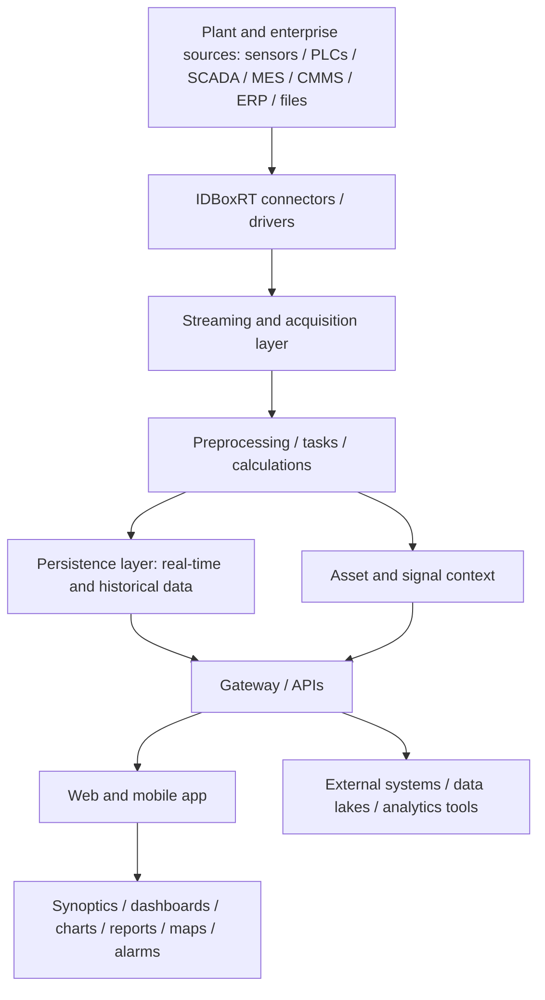

# IDBoxRT

## Executive Summary

IDBoxRT is a draft operational intelligence and industrial data hub platform for integrating, processing, analyzing, and visualizing historical and real-time industrial data. `SRC-IDBOXRT-DOC-0001` supports the product framing as a data hub that collects raw information from heterogeneous sources, prepares it for analysis, and makes it available to different user profiles through use-case-specific tools. Review status: source-backed draft, pending human review.

For this wiki, IDBoxRT should be treated as an IIoT / operational intelligence data layer rather than a confirmed APM platform or historian replacement. The strongest validated areas in this batch are architecture, data acquisition, connector categories, preprocessing, persistence strategies, dashboards/reporting, and access-control concepts. Historian-replacement and product-comparison conclusions remain deferred. Evidence: `SRC-IDBOXRT-DOC-0001`, `SRC-IDBOXRT-DOC-0002`, `SRC-IDBOXRT-DOC-0004`.

## Scope

- In scope:
  - IDBoxRT as a draft IIoT, operational intelligence, and industrial data hub solution.
  - Architecture, acquisition, connector, preprocessing, persistence, dashboard/reporting, deployment, and security notes validated from selected primary documents.
  - Source-backed notes for future manual validation and tender preparation.
  - Open questions for later historian, migration, comparison, and limitation review.
- Out of scope:
  - final vendor claims before human review;
  - pricing, licensing, BOM, quote, fee, discount, or commercial terms;
  - public marketing content;
  - IDBoxRT vs AVEVA PI or IDBoxRT vs historian conclusions;
  - claims based only on NotebookLM-derived files.

## Product Positioning

| Positioning Area | Draft Position | Evidence | Review Status |
|---|---|---|---|
| Operational intelligence platform | IDBoxRT is positioned as a platform for integrating, processing, analyzing, and visualizing historical and real-time operational data. | `SRC-IDBOXRT-DOC-0001` | Validated by source |
| Industrial data hub / plant data layer | IDBoxRT is described as an information data hub that collects data from heterogeneous sources and prepares it for analytics and business use cases. | `SRC-IDBOXRT-DOC-0001` | Validated by source |
| ISA-95-style integration layer | The technical architecture document frames IDBoxRT as integrating information across levels from field devices and control systems through corporate applications and BI layers. | `SRC-IDBOXRT-DOC-0001` | Refined by source |
| Relationship to SCADA / historian systems | IDBoxRT can connect to SCADA and historian systems through connector categories and named examples, but this page does not conclude that IDBoxRT replaces a historian. | `SRC-IDBOXRT-DOC-0001`, `SRC-IDBOXRT-DOC-0004` | Partially supported |
| Relationship to dashboards and analytics | IDBoxRT includes user-facing analysis, synoptics, dashboards, maps, reports, calculations, alarms, events, and notifications. | `SRC-IDBOXRT-DOC-0001`, `SRC-IDBOXRT-DOC-0002` | Validated by source |
| Relationship to APM | Selected sources do not establish IDBoxRT as a full APM platform. Treat APM-adjacent uses as future validation topics. | `SRC-IDBOXRT-DOC-0001`, `SRC-IDBOXRT-DOC-0002`, `SRC-IDBOXRT-DOC-0004` | Not supported by selected sources |
| What remains to validate | Human review should still validate current vendor/legal identity, implementation constraints, detailed sizing, limitations, and comparison criteria. | `SRC-IDBOXRT-DOC-0001`, `SRC-IDBOXRT-DOC-0002`, `SRC-IDBOXRT-DOC-0004` | Still to validate |

## Architecture Overview

The selected primary documents support a more concrete conceptual architecture than the earlier Batch 1 sheet draft. `SRC-IDBOXRT-DOC-0001` describes IDBoxRT as using connectors/drivers to acquire heterogeneous data, a streaming and processing layer, persistence strategies for real-time and historical data, asset hierarchy management, and user-facing web/mobile tools. `SRC-IDBOXRT-DOC-0002` supports the presence of security administration, data acquisition administration, signals, assets, analysis tools, synoptics, charts, historical data, alarms, reports, maps, dashboards, notifications, and sessions.

Diagram evidence: `SRC-IDBOXRT-DOC-0001`, with user-facing module support from `SRC-IDBOXRT-DOC-0002`. Review status: conceptual source-backed draft. Detailed deployment topology, sizing, redundancy, and operational limits remain `Still to validate`.

## Core Components

| Component | Role | Candidate Capabilities | Evidence | Review Status |
|---|---|---|---|---|
| Connectors / drivers | Acquire information from industrial, enterprise, file, service, and other source categories. | Connector catalog covers industrial standards, proprietary protocols, protections, SCADA/other systems, IoT connectors, external services, and other connectors. | `SRC-IDBOXRT-DOC-0001`, `SRC-IDBOXRT-DOC-0004` | Validated by source |
| Streaming and acquisition layer | Move acquired data from drivers into processing components. | The technical architecture describes real-time streaming from connectors into a message queue layer. | `SRC-IDBOXRT-DOC-0001` | Validated by source |
| Processing / tasks | Apply preprocessing and business rules before data is exposed or persisted. | Supported processing areas include data preparation, quality filters, synchronization, resampling, re-propagation, filtering, unit conversion, and data-quality stamping. | `SRC-IDBOXRT-DOC-0001` | Refined by source |
| Persistence layer | Store or expose real-time and historical data according to configured strategies. | The technical architecture describes multiple acquisition/persistence strategies, recent and older historical data tiers, latest-sample storage, and a recommended time-series database approach. | `SRC-IDBOXRT-DOC-0001` | Refined by source |
| Asset and signal context | Organize signals and assets for analysis and navigation. | Asset inventory, signal groups, assets, templates, and hierarchy concepts are supported by the selected documents. | `SRC-IDBOXRT-DOC-0001`, `SRC-IDBOXRT-DOC-0002` | Validated by source |
| Gateway / API layer | Expose data and integration methods to other systems. | The technical architecture describes REST API access and proactive data exposure to third-party systems. | `SRC-IDBOXRT-DOC-0001` | Validated by source |
| Web and mobile application | Provide user access to IDBoxRT information and documents. | The sources support a web application and mobile app access for IDBoxRT elements. | `SRC-IDBOXRT-DOC-0001`, `SRC-IDBOXRT-DOC-0002` | Validated by source |
| Analysis and presentation tools | Provide operational visibility and analysis surfaces. | Supported tool areas include synoptics, charts, diagrams, historical views, alarms, reports, maps, dashboards, transitions, custom web content, notifications, and events. | `SRC-IDBOXRT-DOC-0001`, `SRC-IDBOXRT-DOC-0002` | Validated by source |

## Integration Notes

| Integration Area | Draft Note | Evidence | Review Status |
|---|---|---|---|
| Field and equipment data | IDBoxRT can acquire data from sources such as sensors, meters, analysers, PLCs, IIoT devices, machines, and field networks. | `SRC-IDBOXRT-DOC-0001` | Validated by source |
| Control and operational systems | IDBoxRT is positioned to integrate with control systems and operational applications such as SCADA, HMI, MES, CMMS, LIMS, and quality systems. | `SRC-IDBOXRT-DOC-0001` | Validated by source |
| Corporate applications | IDBoxRT can integrate structured data from corporate platforms such as ERP, SAP, accounting, and related business applications. | `SRC-IDBOXRT-DOC-0001` | Validated by source |
| Industrial protocols | The connector catalog includes industrial standards such as Modbus variants, OPC variants, IEC 60870 variants, IEC 61850, DNP3, ICCP/TASE.2, Siemens S7, Rockwell/CIP family protocols, PROFIBUS, PROFINET, EtherCAT, SNMP, KNX, and related interfaces. | `SRC-IDBOXRT-DOC-0004` | Validated by source |
| SCADA / historian connectors | The connector catalog includes connectors for OSIsoft PI, PI AF, AspenTech IP21, Wonderware, Citect, OVATION, WinCC, PCS7, and Honeywell PHD. This validates connector relevance, not historian replacement. | `SRC-IDBOXRT-DOC-0004` | Validated by source |
| IoT connectors | The connector catalog includes MQTT, RabbitMQ, BACnet/IP, Sigfox, LoRa, and other IoT-oriented connectors. | `SRC-IDBOXRT-DOC-0004` | Validated by source |
| Enterprise and service connectors | The connector catalog includes examples such as IBM Maximo, SAP PM, ServiceNow, SQL Server, Oracle, MySQL, ArcGIS Server, Excel, SharePoint, file readers, FTP file reader, XML file reader, API POST JSON, and monitoring connectors. | `SRC-IDBOXRT-DOC-0004` | Validated by source |
| REST API / external exposure | IDBoxRT exposes REST API methods and can expose raw or transformed data to third-party systems or external architectures. | `SRC-IDBOXRT-DOC-0001` | Validated by source |
| Bidirectional integration | The technical architecture describes acquisition and integration as potentially bidirectional across source systems and business applications. | `SRC-IDBOXRT-DOC-0001` | Validated by source |

Do not infer integration suitability for a specific customer architecture until source documents and project context are reviewed. External-service connector names that imply commercial or market-price data are excluded from this wiki page.

## Deployment Notes

| Topic | Draft Note | Evidence | Review Status |
|---|---|---|---|
| Deployment architecture | The technical architecture references deployment in a Kubernetes cluster and named open-source components. Deployment topology, sizing, and operations model still require a dedicated deployment review. | `SRC-IDBOXRT-DOC-0001` | Partially supported |
| Customer-premises / cloud / mixed deployment | The technical architecture mentions cloud and customer-premises virtual-machine deployment contexts, with a mixed option. Because this appears near distribution context, validate against deployment-specific sources before treating it as final. | `SRC-IDBOXRT-DOC-0001` | Partially supported |
| Persistence strategies | IDBoxRT supports multiple acquisition and persistence strategies, including non-persistent raw acquisition, statistics-oriented approaches, and persisted raw/statistical data approaches. | `SRC-IDBOXRT-DOC-0001` | Refined by source |
| Historical storage tiers | The technical architecture describes storing recent and older historical data in different storage tiers to balance access speed and infrastructure requirements. | `SRC-IDBOXRT-DOC-0001` | Refined by source |
| Real-time and historical data stores | The technical architecture identifies Redis for latest samples and TimescaleDB as a recommended time-series database, with other database engines possible but not necessarily feature-equivalent. | `SRC-IDBOXRT-DOC-0001` | Refined by source |
| Asset hierarchy storage | The technical architecture identifies Tessa and Neo4j for asset hierarchy management. | `SRC-IDBOXRT-DOC-0001` | Refined by source |
| Security administration | The documentation supports security groups, users, roles, permissions, access groups, user profile settings, and session administration concepts. | `SRC-IDBOXRT-DOC-0002` | Validated by source |
| Access-control integration | The selected sources support Keycloak-based access-management context and synchronization with LDAP or Active Directory. This is a product note only, not a wiki implementation plan. | `SRC-IDBOXRT-DOC-0001`, `SRC-IDBOXRT-DOC-0002` | Partially supported |
| Infrastructure requirements | Detailed hardware sizing, redundancy, network zoning, backup/restore, and operational runbook requirements are not validated by this page. | `SRC-IDBOXRT-DOC-0002` | Still to validate |

## Typical Use Cases

| Use Case | Draft Note | Evidence | Review Status |
|---|---|---|---|
| Plant operations visibility | Use IDBoxRT as a candidate layer for real-time and historical operational visibility across plant data sources. | `SRC-IDBOXRT-DOC-0001`, `SRC-IDBOXRT-DOC-0002` | Refined by source |
| Industrial data consolidation | Use IDBoxRT as a candidate data hub for collecting, contextualizing, and preparing heterogeneous data for analysis and downstream systems. | `SRC-IDBOXRT-DOC-0001` | Validated by source |
| Operational KPI calculation | Use IDBoxRT as a candidate platform for calculations and business rules built from operational signals and contextual data. | `SRC-IDBOXRT-DOC-0001`, `SRC-IDBOXRT-DOC-0002` | Refined by source |
| Dashboards and reporting | Use IDBoxRT for dashboards, reports, charts, synoptics, maps, alarms, events, and notifications after validating the required modules and permissions. | `SRC-IDBOXRT-DOC-0001`, `SRC-IDBOXRT-DOC-0002` | Validated by source |
| Integration layer for industrial systems | Use IDBoxRT as a candidate integration layer across industrial protocols, SCADA/historian connectors, IoT connectors, corporate systems, files, databases, and external systems. | `SRC-IDBOXRT-DOC-0001`, `SRC-IDBOXRT-DOC-0004` | Validated by source |
| Historian-adjacent data enablement | IDBoxRT has historian and SCADA connector relevance, but historian replacement or migration conclusions remain out of scope for this page. | `SRC-IDBOXRT-DOC-0004` | Still to validate |

Case-study benefits and quantified outcomes remain deferred until selected primary case-study sources are reviewed. Non-pricing benefits may be included later only if source-backed and reviewed.

## Evidence Sources

| Source ID | Title | Link | Evidence Role | Review Status |
|---|---|---|---|---|
| `SRC-APM-IIOT-0001` | AVENUE APM & IIoT Solutions | [Open source](<https://docs.google.com/spreadsheets/d/1OKfe48zNwTjB1196QU45f8jqNyT8OyszAwLQ-D1gdEw>) | Initial Batch 1 portfolio-level draft context | Draft extracted |
| `SRC-APM-IIOT-0011` | IDBoxRT source folder | [Open source](<https://drive.google.com/drive/folders/17Q2yiUSr7GmIlhvRyclGZ4whhPsezzov>) | Parent IDBoxRT source folder | Batch 1.10 document audit completed |
| `SRC-IDBOXRT-DOC-0001` | IDboxRT description and technical architecture.docx | [Open source](<https://docs.google.com/document/d/1qD_TuIVzKLma3pB2uTAlhl-BufEfQDX7/edit?usp=drivesdk&ouid=108564093758567510758&rtpof=true&sd=true>) | Primary reviewed source for positioning, architecture, modules, connectors, contextualization, persistence, API, and KPI model | In progress |
| `SRC-IDBOXRT-DOC-0002` | IDboxRT documentation.pdf | [Open source](<https://drive.google.com/file/d/1fL2X0yelmvvhNWQHTYDFae-AedkAFtYc/view?usp=drivesdk>) | Primary reviewed source for user-facing modules, administration, security, data acquisition, signals, assets, dashboards, reports, alarms, events, and sessions | In progress |
| `SRC-IDBOXRT-DOC-0003` | IDbox User Manual.pdf | [Open source](<https://drive.google.com/file/d/1MSLnC2M6eqyk44kCUwGTDAtJmXcUFV5r/view?usp=drivesdk>) | Optional future validation source for detailed user workflows | Not started |
| `SRC-IDBOXRT-DOC-0004` | IDboxRT connectors.pdf | [Open source](<https://drive.google.com/file/d/1kzn0dCMwvGUXCQROvTQKhcWDliPHPlb9/view?usp=drivesdk>) | Primary reviewed source for connector categories, supported protocols, SCADA/historian connectors, IoT connectors, and enterprise/service connectors | In progress |
| `SRC-IDBOXRT-DOC-0005` | IDBoxRT General Presentation - 06.05.2024.pptx | [Open source](<https://docs.google.com/presentation/d/1Wre2K4U0KW_Dfol5K4uYt98LrofP582y/edit?usp=drivesdk&ouid=108564093758567510758&rtpof=true&sd=true>) | Future validation target for product positioning, vendor context, capabilities overview, and use cases; review for sales/commercial language | Not started |
| `SRC-IDBOXRT-DOC-0006` | Dashboards.pdf | [Open source](<https://drive.google.com/file/d/1JA_SUw5kvNbZjC_3q1nSABbXn6Vcvu4X/view?usp=drivesdk>) | Future validation target for dashboard and reporting capabilities | Not started |
| `SRC-IDBOXRT-DOC-0007` | IDboxRT synoptic examples.pdf | [Open source](<https://drive.google.com/file/d/15rxUqy_C_hhIWCSRrVbk41dg1V8cKyai/view?usp=drivesdk>) | Future validation target for visualization and operator UI examples; do not copy screenshots into wiki without review | Not started |
| `SRC-IDBOXRT-DOC-0008` | IDboxRT mobile app EN.pdf | [Open source](<https://drive.google.com/file/d/1PQoxtN1D7YpeqJb3HYTnHqMp51kJlKlt/view?usp=drivesdk>) | Future validation target for mobile access, workflows, and security implications | Not started |
| `SRC-IDBOXRT-DOC-0009` | Installation Review - Avenue.docx | [Open source](<https://docs.google.com/document/d/1pksaaUjO4mrTcxFfNnxwUMbVskhQeZPi/edit?usp=drivesdk&ouid=108564093758567510758&rtpof=true&sd=true>) | Future validation target for deployment and infrastructure; review for project-specific or restricted context | Not started |
| `SRC-IDBOXRT-DOC-0010` | Guía Instalación IDbox 3 en Windows desde Cero (IDboxRT)_en.pdf | [Open source](<https://drive.google.com/file/d/1kTDMXa66k8F6cIP4jdAjKRR4A8y9hspp/view?usp=drivesdk>) | Future validation target for deployment model, installation, system requirements, and limitations | Not started |
| `SRC-IDBOXRT-DOC-0011` | Guía Instalación Keycloak en Windows (IDboxRT)_en.pdf | [Open source](<https://drive.google.com/file/d/170zRcfOEfaiaQ-riMYBfH-zNJ3OIDuN4/view?usp=drivesdk>) | Future validation target for access-control and authentication-adjacent deployment details | Not started |
| `SRC-IDBOXRT-DOC-0012` | IDBoxRT as new Historian Solution for Power Generation Customers.docx | [Open source](<https://docs.google.com/document/d/1ihZ2ItXGpEYD9kQA-zOKJiAOMVjfbdPn/edit?usp=drivesdk&ouid=108564093758567510758&rtpof=true&sd=true>) | Future validation target for historian positioning and assumptions; no comparison conclusions in this batch | Not started |
| `SRC-IDBOXRT-DOC-0013` | IDboxRT migration pathv2.pdf | [Open source](<https://drive.google.com/file/d/1AJk6ujx-CgxNHpbj4DvQ5eoWFzdlIvEn/view?usp=drivesdk>) | Future validation target for migration and coexistence questions; no comparison conclusions in this batch | Not started |
| `SRC-IDBOXRT-EXTRACT-0001` | 01_IDBoxRT Extracted Keys.md | [Open source](<https://drive.google.com/file/d/1YNaeMQ3JkAxYN0uf4KNPO1ZrydBY9Mz4/view?usp=drivesdk>) | Derived review aid only; candidate capability and tender topic discovery | Not evidence for final claims |
| `SRC-IDBOXRT-EXTRACT-0002` | 02_IDBoxRT Business Section.md | [Open source](<https://drive.google.com/file/d/1h__UK28RSeJDhj6IMiRl2AmK63UUt6XM/view?usp=drivesdk>) | Derived review aid only; candidate business and use-case framing | Not evidence for final claims |
| `SRC-IDBOXRT-EXTRACT-0003` | 03_IDBoxRT Technical Section.md | [Open source](<https://drive.google.com/file/d/1a6_NerCFHyrFX-wbgrFr_rCwrVdSJ9aL/view?usp=drivesdk>) | Derived review aid only; candidate architecture and integration checklist support | Not evidence for final claims |
| `SRC-IDBOXRT-EXTRACT-0004` | 04_IDBoxRT Use cases, Deployment and BOM.md | No wiki evidence link; restricted pricing-risk source | Excluded from wiki enrichment except to identify restricted content | Restricted / not used |

## Source-Backed Draft Notes

### Source Coverage

| Source ID | Source Title | Extraction Status | Notes |
|---|---|---|---|
| `SRC-APM-IIOT-0001` | AVENUE APM & IIoT Solutions | Batch 1 draft extracted | Main source used for the initial IDBoxRT draft extraction batch; reference URLs in the sheet were treated only as supporting references. |
| `SRC-APM-IIOT-0011` | IDBoxRT | Batch 1.10 document audit completed | Registered source folder exists; document-level source candidates have been identified. |
| `SRC-IDBOXRT-DOC-0001` | IDboxRT description and technical architecture.docx | Batch 1.11 validation in progress | Reviewed for product positioning, architecture, acquisition, processing, persistence, API, dashboard/reporting, and product-boundary notes. |
| `SRC-IDBOXRT-DOC-0002` | IDboxRT documentation.pdf | Batch 1.11 validation in progress | Reviewed for user-facing modules, administration, security concepts, acquisition administration, signals, assets, dashboards, reports, alarms, events, and sessions. |
| `SRC-IDBOXRT-DOC-0004` | IDboxRT connectors.pdf | Batch 1.11 validation in progress | Reviewed for connector categories, protocol examples, SCADA/historian connectors, IoT connectors, and enterprise/service connectors. |
| `SRC-IDBOXRT-EXTRACT-0001` to `SRC-IDBOXRT-EXTRACT-0003` | IDBoxRT NotebookLM markdown summaries | Review aids only | Used only for organizing candidate review topics; not treated as primary evidence. |

### Draft Facts from Source

| Topic | Draft Note | Evidence Source | Review Status |
|---|---|---|---|
| General concept | IDBoxRT is an operational intelligence platform and information data hub for integrating, processing, analyzing, and visualizing historical and real-time data. | `SRC-IDBOXRT-DOC-0001` | Refined by source |
| Vendor | The Batch 1 source sheet lists CIC Consulting Informatico from Spain as the vendor. The selected primary documents support CIC involvement, but legal vendor identity and current ownership still need human confirmation. | `SRC-APM-IIOT-0001`, `SRC-IDBOXRT-DOC-0001` | Partially supported |
| Problems solved | IDBoxRT is positioned around sharing information automatically across industrial systems, reducing response time, reducing errors, and making data available for operational decision support. | `SRC-IDBOXRT-DOC-0001` | Refined by source |
| Core capabilities | Selected sources support data acquisition, connector-based integration, preprocessing, persistence strategies, asset/signal context, calculations, dashboards, synoptics, charts, reports, maps, alarms, notifications, and API exposure. | `SRC-IDBOXRT-DOC-0001`, `SRC-IDBOXRT-DOC-0002`, `SRC-IDBOXRT-DOC-0004` | Refined by source |
| Typical use cases | Current sources support operational visibility, industrial data consolidation, calculation/KPI workflows, reporting/dashboarding, and integration-layer use cases. | `SRC-IDBOXRT-DOC-0001`, `SRC-IDBOXRT-DOC-0002`, `SRC-IDBOXRT-DOC-0004` | Refined by source |
| Integration relevance | Selected sources support field, control, operational, corporate, SCADA/historian, IoT, database, file, and API integration categories. | `SRC-IDBOXRT-DOC-0001`, `SRC-IDBOXRT-DOC-0004` | Validated by source |
| Deployment model | Deployment and persistence strategies are partially supported, but full deployment topology, sizing, redundancy, backup/restore, and operations model need additional validation. | `SRC-IDBOXRT-DOC-0001`, `SRC-IDBOXRT-DOC-0002` | Partially supported |
| APM / IIoT / historian positioning | IDBoxRT is better described here as an IIoT / operational intelligence / industrial data hub. Historian replacement and APM positioning require later source review. | `SRC-IDBOXRT-DOC-0001`, `SRC-IDBOXRT-DOC-0004` | Partially supported |

## Document-Level Validation Notes

### Document Coverage

| Source ID | Document Title | Validation Role | Extraction Status |
|---|---|---|---|
| `SRC-IDBOXRT-DOC-0001` | IDboxRT description and technical architecture.docx | Primary reviewed source for architecture, data hub framing, components, acquisition, processing, persistence, API exposure, and product boundaries. | In progress |
| `SRC-IDBOXRT-DOC-0004` | IDboxRT connectors.pdf | Primary reviewed source for supported connector categories and representative protocol/system connectors. | In progress |
| `SRC-IDBOXRT-DOC-0002` | IDboxRT documentation.pdf | Primary reviewed source for functional modules, security administration concepts, signals, assets, dashboards, reports, events, alarms, notifications, and sessions. | In progress |
| `SRC-IDBOXRT-DOC-0003` | IDbox User Manual.pdf | Optional supporting source for future detailed workflow validation; not reviewed in this batch. | Not started |

### Validated / Refined Draft Facts

| Topic | Batch 1 Draft Note | Validation Result | Evidence Source | Review Status |
|---|---|---|---|---|
| Official product positioning | Batch 1 treated IDBoxRT as an operational intelligence / industrial data hub candidate. | Refined by source: selected primary evidence supports operational intelligence and information data hub framing. | `SRC-IDBOXRT-DOC-0001` | Refined by source |
| Architecture and major modules | Batch 1 architecture was conceptual. | Refined by source: page now identifies connectors/drivers, streaming/acquisition, processing/tasks, persistence, asset context, gateway/API, web/mobile app, and user-facing tools. | `SRC-IDBOXRT-DOC-0001`, `SRC-IDBOXRT-DOC-0002` | Refined by source |
| Supported data sources/connectors | Batch 1 said heterogeneous data collection. | Validated by source: selected documents support industrial, SCADA/historian, IoT, enterprise, file, database, API, and service connector categories. | `SRC-IDBOXRT-DOC-0001`, `SRC-IDBOXRT-DOC-0004` | Validated by source |
| Protocol/API/interface support | Batch 1 kept protocol/API support open. | Refined by source: page now includes representative industrial protocol categories, SCADA/historian connectors, IoT connectors, enterprise/service connectors, and REST API exposure. | `SRC-IDBOXRT-DOC-0001`, `SRC-IDBOXRT-DOC-0004` | Refined by source |
| SCADA/historian relationship | Batch 1 listed SCADA/Historian-layer relevance. | Partially supported: connectors validate SCADA/historian integration relevance, but historian replacement conclusions are not made. | `SRC-IDBOXRT-DOC-0001`, `SRC-IDBOXRT-DOC-0004` | Partially supported |
| Data storage and retention | Batch 1 did not validate storage. | Refined by source: page now documents persistence strategies, latest-sample storage, historical storage, and tiered history concepts at a draft level. | `SRC-IDBOXRT-DOC-0001` | Refined by source |
| Contextualization/preprocessing | Batch 1 listed contextualization and preprocessing. | Refined by source: selected evidence supports asset/signal context and preprocessing tasks such as data preparation, quality filters, synchronization, resampling, re-propagation, filtering, and unit conversion. | `SRC-IDBOXRT-DOC-0001`, `SRC-IDBOXRT-DOC-0002` | Refined by source |
| KPI/calculation model | Batch 1 listed KPI calculation. | Partially supported: selected sources support calculation functions, business rules, and diagram/function tools, but detailed KPI governance still needs validation. | `SRC-IDBOXRT-DOC-0001`, `SRC-IDBOXRT-DOC-0002` | Partially supported |
| Dashboard/reporting capabilities | Batch 1 listed interactive reporting. | Validated by source: selected sources support dashboards, reports, charts, synoptics, maps, alarms, events, and notifications. | `SRC-IDBOXRT-DOC-0001`, `SRC-IDBOXRT-DOC-0002` | Validated by source |
| Deployment model | Batch 1 listed on-premises, cloud, and hybrid as candidates. | Partially supported: selected evidence mentions cloud/customer-premises virtual-machine/mixed contexts and deployment architecture components, but detailed deployment model still needs deployment-source validation. | `SRC-IDBOXRT-DOC-0001` | Partially supported |
| Security/access control | Batch 1 did not validate security. | Refined by source: selected evidence supports security groups, users, roles, permissions, access groups, sessions, Keycloak context, and LDAP/Active Directory synchronization. | `SRC-IDBOXRT-DOC-0001`, `SRC-IDBOXRT-DOC-0002` | Refined by source |
| Limitations and product boundaries | Batch 1 kept limits open. | Still to validate: selected sources support capabilities but do not provide enough neutral limitation detail for final product-boundary claims. | `SRC-IDBOXRT-DOC-0001`, `SRC-IDBOXRT-DOC-0002`, `SRC-IDBOXRT-DOC-0004` | Still to validate |
| Pricing/commercial content | Batch 1 required exclusion. | Excluded from wiki: commercial sections and pricing-risk derived sources remain out of scope. | N/A | Excluded from wiki |

## Open Questions

- Which current vendor/legal identity and product ownership details should be used after human review?
- Which deployment source should confirm sizing, redundancy, backup/restore, network zones, and production operations model?
- Which IDBoxRT limits should be documented for retention, scale, connector behavior, API throughput, and enterprise reporting?
- Which calculation/KPI governance rules should be documented for production use?
- Which security details should be separated into product facts versus customer-specific implementation design?
- Does IDBoxRT store historian-grade time-series data, complement existing historians, or replace some historian use cases in specific contexts? Keep this open until the historian-positioning and migration documents are reviewed.
- Which comparison claims belong in `idboxrt-vs-historian.md` only after a later comparison batch?
- Which claims from the NotebookLM-derived files can be validated against original IDBoxRT source documents?

## Excluded Content

- Pricing, licensing, discounts, commercial quotes, proposal prices, budgetary prices, BOM prices, service fees, support fees, training fees, and commercial terms are excluded from this wiki page.
- `SRC-IDBOXRT-EXTRACT-0004` is a high-pricing-risk derived source and was not used for wiki enrichment.
- Connector names or external-service references that imply commercial market-price data are excluded from this page.
- IDBoxRT vs AVEVA PI, historian replacement, and migration-path conclusions are excluded from this batch.
- Case-study claims and quantified benefits remain deferred until selected primary case-study sources are reviewed and commercial content is excluded.
- NotebookLM-derived content is not treated as approved knowledge and cannot independently support wiki claims.

## Related Capability Pages

- [IIoT Platform](../capabilities/iiot-platform)
- [Industrial Historian](../capabilities/industrial-historian)
- [Asset Performance Management](../capabilities/apm)

## Related Pattern Pages

- [Edge to Center](../patterns/edge-to-center)
- [OPC UA Integration](../patterns/opc-ua-integration)
- [MQTT Sparkplug](../patterns/mqtt-sparkplug)
- [SCADA/DCS Data Ingestion](../patterns/scada-dcs-data-ingestion)

## Review Notes

- Keep this page `draft`, `private`, and `confidence: low` until product document review and human review are complete.
- Keep historian replacement, migration, and IDBoxRT vs AVEVA PI comparison conclusions deferred.
- Keep pricing, licensing, BOM, and restricted commercial notes outside this page.
