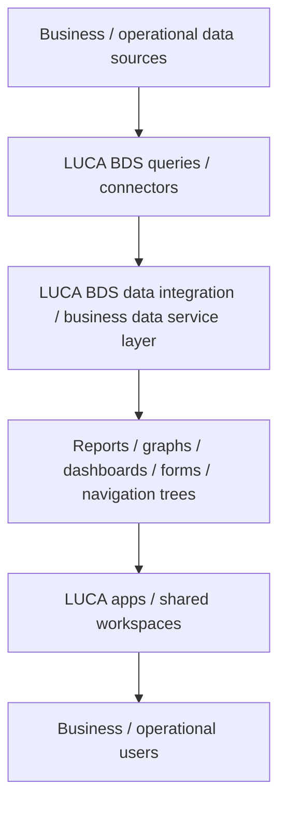

# LUCA BDS

## Executive Summary

LUCA BDS is a business intelligence, data integration, and analytics layer for teams that need usable views of data spread across multiple business and operational systems. Position it when the customer problem is not a historian or APM requirement by itself, but a need to access data, organize queries and data flows, build dashboards/reports/forms/navigation, and support business or operational decision-making.

At a practical presales level, LUCA BDS fits conversations about dispersed data, reporting workload, integrated views, shared analysis workspaces, and decision support. AI/LLM-related material appears in reviewed product context, but this page keeps those claims bounded and does not position LUCA BDS as a general AI platform.

This page is for internal draft use. The top sections are written for fast sales/presales reading; the lower sections preserve evidence links, validation notes, open questions, and restricted-content handling.

## Scope Decision

Decision: `in_scope_for_m2_solution_page`, with controlled overview enrichment only.

LUCA BDS fits the current M2 Tech Knowledge Base as a business intelligence, data integration, and analytics layer for operational and business data. It should not yet be described as an IIoT platform, historian, APM system, or AI platform. Those labels remain `Still to validate` unless future technical review supports them.

## Where It Fits

| Fit Area | Presales Guidance | Confidence |
|---|---|---|
| Primary positioning conversation | BI, data integration, reporting, dashboards, analytics, and decision-support views across multiple systems. | Validated draft |
| Primary audience | Business users, operations users, analysts, managers, and teams that need shared data views. | Validated draft |
| Data relationship | Helps users access, organize, analyze, and present data from multiple business and operational systems. | Validated draft |
| APM & IIoT relationship | Relevant where industrial or utility data needs business-facing analytics and reporting, but not yet an APM or IIoT platform claim. | Partially validated |
| Historian relationship | Treat historian behavior, time-series storage, and live-query/no-copy assumptions as validation topics. | Still to validate |
| AI / LLM positioning | Keep AI/LLM material bounded as product context until implementation, security, and use-case details are reviewed. | Still to validate |

## Validation Status

- Validated draft: BI/data integration/analytics positioning, multi-source data access, query-driven reports/dashboards/forms/navigation, and business/operational reporting use.
- Partially validated: APM & IIoT portfolio relevance, on-premises/local-control positioning, shared workspaces, real-time BI language, and live-query/no-copy behavior.
- Still to validate: connector details, deployment topology, security/access control, storage/caching behavior, performance limits, AI/LLM boundaries, and whether any historian/APM/IIoT-platform wording is appropriate.

## Customer Problems It Addresses

| Problem Area | How LUCA BDS Helps |
|---|---|
| Dispersed data | Gives users a way to access and analyze data spread across multiple systems. |
| Reporting workload | Supports dashboards, charts, reports, forms, and structured navigation around data. |
| Decision support | Helps business and operational users create integrated views for analysis and decision-making. |
| Shared analysis | Supports shared workspaces and common views so teams are not working from disconnected files or isolated systems. |
| Data control expectations | Local/on-premises and live-query themes may be relevant, but deployment and security architecture need validation. |

## What It Does

| Capability | Plain-Language Description | Confidence |
|---|---|---|
| Data source access | Connects users to data from multiple business and operational systems. | Validated draft |
| Query and data-flow organization | Helps organize queries, dashboards, reports, graphs, forms, navigation trees, and app-like views. | Validated draft |
| Dashboards and reporting | Presents data through dashboards, charts, graphs, reports, and shared views. | Validated draft |
| Real-time BI positioning | Supports a real-time BI conversation, while the precise technical meaning should be clarified per opportunity. | Partially validated |
| Live-query / no-copy positioning | Useful as a discovery topic for data ownership and architecture; validate actual behavior before design commitments. | Partially validated |
| Local / on-premises control | Relevant where customers care about local control, data residency, or on-premises analysis. | Partially validated |
| Product-specific AI assistance | Keep as a bounded product-review topic until security, deployment, and use-case boundaries are confirmed. | Still to validate |

## Architecture / Data Flow Notes

LUCA BDS can be explained to customers as a business data service layer between source systems and the people who need usable views. Business and operational data sources feed LUCA BDS query/connectors, LUCA BDS organizes that data into reports, graphs, dashboards, forms, navigation trees, and app-like views, and users work from shared analysis spaces.

In a typical discussion, position the architecture as four logical layers: data sources, LUCA BDS access/query layer, presentation and workspace elements, and business or operational users. Connector details, deployment topology, security model, live-query behavior, and performance limits should be validated during solution planning.

Diagram caption: This conceptual view shows business and operational data sources flowing through LUCA BDS query/connectors and a business data service layer into reports, dashboards, forms, navigation, shared workspaces, and users. Connector details, deployment topology, security model, and performance boundaries remain implementation validation items.

## Core Capabilities

| Capability | Role | Presales Explanation |
|---|---|---|
| Data integration | Unified access | Bring data from multiple systems into a shared analysis and reporting experience. |
| Business analytics | Decision support | Support reusable views and analytics outputs for business and operational users. |
| Dashboards / charts | Visual analysis | Present data through dashboards, charts, and graphs. |
| Reports | Structured output | Generate and organize reports for users and teams. |
| Forms / navigation trees | Guided views | Build structured navigation and app-like views around data and reports. |
| Shared workspaces | Team analysis | Support shared analysis contexts so users can work from common data views. |
| Forecasting / anomaly analytics | Advanced analytics topic | Keep as a later validation topic before presenting it as a strong feature claim. |
| Private/local AI assistance | Product-boundary topic | Keep in validation until security, deployment, data handling, and use-case boundaries are reviewed. |

## Typical Use Cases

| Use Case | Presales Description |
|---|---|
| Production visibility | Create integrated views for production and OEE-style analysis when customer context supports it. |
| Quality analysis | Support quality-control and defect-rate analysis conversations. |
| Utility energy monitoring | Support energy-efficiency analysis and reporting conversations. |
| Utility water management | Support water-management analysis and reporting conversations. |
| Executive / operational reporting | Provide dashboards and reports for management and operational reporting workflows. |

## Presales Qualification Notes

- Confirm whether the customer problem is BI/reporting, data integration, operational visibility, analytics, or a true historian/APM requirement.
- Identify source systems, data owners, access methods, refresh expectations, and security constraints.
- Validate whether the customer expects live query, replicated storage, or time-series historian behavior.
- Confirm dashboard/reporting users, shared workspace needs, and report governance.
- Treat AI/LLM-related needs as a separate product validation topic; do not assume NOVA AI Q&A or AI orchestration scope.
- Keep commercial estimates, licenses, fees, package language, and proposal terms outside this wiki.

## What To Validate With Customer

- Which data sources must LUCA BDS connect to?
- Are required connectors already supported, or would custom integration be needed?
- Does the customer need live access, data replication, cached data, or historian-grade storage?
- What deployment model is required: on-premises, customer-managed infrastructure, or other hosting?
- What user roles, access-control policies, and data-governance constraints apply?
- Which dashboards, reports, forms, and app views are required?
- Are AI/LLM features required, permitted, or prohibited by security policy?
- What limitations should be documented for performance, data volume, refresh rates, and source-system load?

## Evidence Sources

| Source ID | Title | Link | Evidence Role | Review Status |
|---|---|---|---|---|
| `SRC-APM-IIOT-0004` | Luca BDS source folder | [Open source](<https://drive.google.com/drive/folders/1LNdeA2uNC6dp0IA63m1V5UV0_6Vv8mkg>) | Parent LUCA BDS source folder | Batch 1.12 document audit completed |
| `SRC-LUCA-BDS-DOC-0001` | LUCABDS_2026 [EN].pdf | [Open source](<https://drive.google.com/file/d/1EUZX1O0heO_sdI99S-aFxv6Qz6_Ejpzd/view?usp=drivesdk>) | Primary overview evidence for controlled draft enrichment | In progress |
| `SRC-LUCA-BDS-WEB-0001` | Official LUCA BDS Website | [Open source](<https://www.luca-bds.com/>) | Public supporting reference for future reviewer traceability; not primary technical evidence | Referenced; local shell access unavailable |
| `SRC-LUCA-BDS-EXTRACT-0001` | 01_LUCA BDS Extracted Keys.md | [Open source](<https://drive.google.com/file/d/12SuBJobJFDC0wvbB7QmJDOp7xYJRBCQq/view?usp=drivesdk>) | Derived review aid only; candidate topic discovery | Not evidence for final claims |
| `SRC-LUCA-BDS-EXTRACT-0002` | 02_LUCA BDS Business Sector.md | [Open source](<https://drive.google.com/file/d/1UA2vwL0W3b-FOBWYkLFw_Z59XlTyDlz2/view?usp=drivesdk>) | Derived review aid only; candidate business/use-case framing | Not evidence for final claims |
| `SRC-LUCA-BDS-EXTRACT-0003` | 03_LUCA BDS Technical Sector.md | [Open source](<https://drive.google.com/file/d/1REsPLGzGkoUTCRCxRvL3VNIrJ9TuuzwI/view?usp=drivesdk>) | Derived review aid only; candidate technical validation checklist support | Not evidence for final claims |
| `SRC-LUCA-BDS-EXTRACT-0004` | 04_LUCA BDS Case studies, BOM, Deployment.md | No wiki evidence link; restricted pricing-risk source | Excluded from wiki enrichment except to identify restricted content | Restricted / not used |

## Document-Level Validation Notes

### Document Coverage

| Source ID | Source Title | Validation Role | Extraction Status |
|---|---|---|---|
| `SRC-LUCA-BDS-DOC-0001` | LUCABDS_2026 [EN].pdf | Primary overview evidence for positioning, data-flow concepts, dashboards, reporting, and candidate use cases | In progress |
| `SRC-LUCA-BDS-EXTRACT-0001` | 01_LUCA BDS Extracted Keys.md | Derived review aid for candidate topic discovery | Not started / needs source validation |
| `SRC-LUCA-BDS-EXTRACT-0002` | 02_LUCA BDS Business Sector.md | Derived review aid for business/use-case framing | Not started / needs source validation |
| `SRC-LUCA-BDS-EXTRACT-0003` | 03_LUCA BDS Technical Sector.md | Derived review aid for technical validation planning | Not started / needs source validation |
| `SRC-LUCA-BDS-WEB-0001` | Official LUCA BDS Website | Public supporting reference for future terminology review | Referenced |

### Validated / Refined Draft Facts

| Topic | Draft Note | Validation Result | Evidence Source | Review Status |
|---|---|---|---|---|
| Product positioning | LUCA BDS belongs on a controlled draft solution page as BI/data integration/analytics, not as a confirmed historian/APM/IIoT platform. | Refined by source | `SRC-LUCA-BDS-DOC-0001` | Partially supported |
| Data integration | Product overview supports connecting to multiple data sources and building analysis/reporting views. | Validated by source | `SRC-LUCA-BDS-DOC-0001` | Draft / source-backed |
| Dashboards and reports | Dashboards, charts/graphs, and reports are supported output patterns. | Validated by source | `SRC-LUCA-BDS-DOC-0001` | Draft / source-backed |
| Real-time BI | Source positions the product as real-time BI, but technical mechanics remain unresolved. | Refined by source | `SRC-LUCA-BDS-DOC-0001` | Partially supported |
| Live-query / no-copy behavior | Source includes live-query/no-copy positioning, but this needs architecture and performance validation. | Refined by source | `SRC-LUCA-BDS-DOC-0001` | Partially supported |
| Deployment model | Source includes on-premises/local-control positioning, but detailed topology and security controls need validation. | Refined by source | `SRC-LUCA-BDS-DOC-0001` | Partially supported |
| AI/LLM material | Product-specific AI material exists but remains bounded to LUCA BDS review context and does not expand NOVA scope. | Still to validate | `SRC-LUCA-BDS-DOC-0001` | Still to validate |
| Pricing/commercial material | Commercial sections and calls to action are excluded from wiki knowledge. | Excluded from wiki | `SRC-LUCA-BDS-DOC-0001`; `SRC-LUCA-BDS-EXTRACT-0004` | Restricted |

## Open Questions

- Which document should be treated as authoritative for LUCA BDS architecture and connector details?
- Which connectors and source-system interfaces are officially supported?
- What is the validated deployment model, including on-premises and local-analysis boundaries?
- What security and access-control model is supported?
- What does real-time BI mean technically for LUCA BDS?
- Does LUCA BDS store any data, cache query outputs, or always query source systems live?
- Which analytics and dashboard capabilities are core product features versus implementation examples?
- How should LUCA BDS be positioned relative to IIoT platform, historian, operational data platform, and BI-layer categories?
- Which AI/LLM-related statements are safe product facts, and which should remain out of the wiki until human review?
- What limitations should be documented for data volume, refresh rate, source-system load, performance, and governance?

## Excluded Content

- Pricing, licensing, discounts, commercial quotes, proposal prices, budgetary prices, BOM prices, service fees, support fees, training fees, and commercial terms are excluded from this wiki page.
- `SRC-LUCA-BDS-EXTRACT-0004` is a high-pricing-risk derived source and was not used for wiki enrichment.
- Commercial calls to action, quote language, contact/sales form language, commercial packaging, and business-model notes from mixed sources are excluded from wiki knowledge.
- Case-study claims and quantified benefits remain deferred until selected primary case-study sources are reviewed and commercial content is excluded.
- NotebookLM-derived content is not treated as approved knowledge and cannot independently support wiki claims.
- AI/LLM-related product material is treated only as LUCA BDS source-review context; it does not expand NOVA Knowledge Hub scope into AI chat, AI orchestration, Knowledge Graph, Modes, or Skills.
- No comparison claims are made against IDBoxRT, Canary, AVEVA PI, EtaPRO, IBM MAS, or historian products.

## Review Notes

- Keep this page `draft`, `private`, and `confidence: low`.
- Treat this page as a controlled overview and validation-preparation page, not approved final product knowledge.
- Do not move LUCA BDS claims beyond draft until architecture, connectors, deployment, security, data-handling behavior, AI boundaries, limitations, and product boundaries are validated by primary sources and human review.
