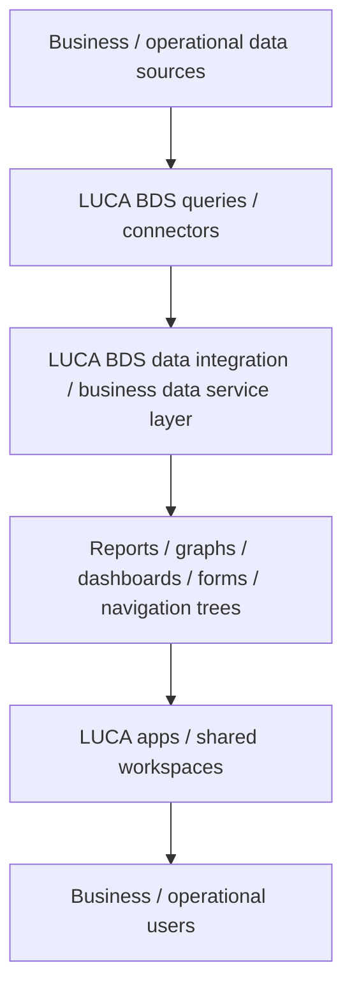

# LUCA BDS

## Executive Summary

LUCA BDS is tracked in this wiki as a draft business intelligence, data integration, and analytics solution related to the APM & IIoT portfolio. `SRC-LUCA-BDS-DOC-0001` positions the product around access to data from multiple systems, centralized analysis, dashboards, reports, and business/operational decision support.

This page is a controlled M2 draft. It is useful for solution orientation and presales qualification, but it is not yet approved knowledge. NotebookLM extracted files are review aids only, and the official website is registered as a public supporting reference rather than primary internal technical evidence.

## Scope Decision

Decision after Batch 1.13: `in_scope_for_m2_solution_page`, with controlled overview enrichment only.

LUCA BDS fits the current M2 Tech Knowledge Base as a business intelligence, data integration, and analytics layer for operational and business data. It should not yet be described as an IIoT platform, historian, APM system, or AI platform. Those labels remain `Still to validate` unless supported by future primary technical sources.

## Where It Fits

| Fit Area | Draft Positioning | Evidence | Review Status |
|---|---|---|---|
| Business intelligence / analytics | LUCA BDS is positioned as a solution for integrating and analyzing data from multiple systems and presenting it through dashboards, reports, and views. | `SRC-LUCA-BDS-DOC-0001` | Validated by source |
| Data integration / access layer | The primary overview describes connecting to multiple data sources and organizing queries, reports, graphs, dashboards, forms, and app views. | `SRC-LUCA-BDS-DOC-0001` | Validated by source |
| APM & IIoT portfolio relevance | LUCA BDS is relevant where industrial or utility data needs to be consolidated for analysis, reporting, and operational visibility. | `SRC-LUCA-BDS-DOC-0001` | Partially supported |
| Historian / IIoT platform relationship | LUCA BDS should not yet be treated as a historian or IIoT platform replacement. | `SRC-LUCA-BDS-DOC-0001` | Still to validate |
| AI / LLM product material | Source material includes product-specific AI/LLM context, but this is not enough to expand NOVA Knowledge Hub scope or define LUCA BDS as an AI platform. | `SRC-LUCA-BDS-DOC-0001` | Still to validate |

## Customer Problems It Addresses

| Problem Area | Draft Note | Evidence | Review Status |
|---|---|---|---|
| Dispersed data | LUCA BDS is relevant when data sits across multiple business or operational systems and users need a centralized way to access and analyze it. | `SRC-LUCA-BDS-DOC-0001` | Validated by source |
| Reporting workload | The source supports dashboards, charts, and reports as core output patterns. | `SRC-LUCA-BDS-DOC-0001` | Validated by source |
| Data-driven decisions | The product overview frames the solution around improving decision support through integrated data and analytics. | `SRC-LUCA-BDS-DOC-0001` | Validated by source |
| Secure access and data control | The source includes on-premises/local-control positioning, but deployment and security architecture still need primary technical validation. | `SRC-LUCA-BDS-DOC-0001` | Partially supported |

## What It Does

| Capability | Draft Description | Evidence | Review Status |
|---|---|---|---|
| Data source connection | Connects to multiple data sources for analysis and reporting workflows. | `SRC-LUCA-BDS-DOC-0001` | Validated by source |
| Query and data-flow organization | Supports query-driven construction of dashboards, reports, graphs, forms, navigation trees, and app-like views. | `SRC-LUCA-BDS-DOC-0001` | Validated by source |
| Dashboards and reporting | Provides dashboard, graph, chart, and report presentation patterns for business and operational users. | `SRC-LUCA-BDS-DOC-0001` | Validated by source |
| Real-time BI positioning | The primary overview positions LUCA BDS as real-time business intelligence. The precise technical meaning of real-time remains to validate. | `SRC-LUCA-BDS-DOC-0001` | Partially supported |
| Live-query / no-copy positioning | The source describes a live-query, no-copy/no-replication data approach. Architecture, connector behavior, and performance boundaries still need validation. | `SRC-LUCA-BDS-DOC-0001` | Partially supported |
| Local / on-premises control | The source presents local or on-premises control as a product theme. Deployment models and security controls remain to validate. | `SRC-LUCA-BDS-DOC-0001` | Partially supported |
| Product-specific AI assistance | The source includes AI/LLM-related product material. Treat this as product context only until implementation boundaries, security, and use cases are reviewed. | `SRC-LUCA-BDS-DOC-0001` | Still to validate |

## Architecture / Data Flow Notes

The current evidence supports only a high-level conceptual data flow. The diagram below is a draft interpretation of the source-backed concepts: source systems, queries/connectors, LUCA BDS organization layer, presentation elements, shared workspaces, and users.

Review status: `Partially supported` by `SRC-LUCA-BDS-DOC-0001`. Connector details, deployment topology, security model, and performance boundaries are still to validate.

## Core Capabilities

| Capability | Candidate Role | Evidence | Review Status |
|---|---|---|---|
| Data integration | Bring data from multiple systems into a unified analysis/reporting experience. | `SRC-LUCA-BDS-DOC-0001` | Validated by source |
| Business analytics | Support analysis of business and operational data through reusable views and analytics outputs. | `SRC-LUCA-BDS-DOC-0001` | Validated by source |
| Dashboards / charts | Present data through dashboards, charts, and graphs. | `SRC-LUCA-BDS-DOC-0001` | Validated by source |
| Reports | Generate and organize reports for users and teams. | `SRC-LUCA-BDS-DOC-0001` | Validated by source |
| Forms / navigation trees | Build structured views and application-like navigation around data and reports. | `SRC-LUCA-BDS-DOC-0001` | Validated by source |
| Shared workspaces | Support shared analysis contexts for teams. | `SRC-LUCA-BDS-DOC-0001` | Partially supported |
| Forecasting / anomaly analytics | Source material references time-series and analytical patterns, but these require deeper validation before becoming strong feature claims. | `SRC-LUCA-BDS-DOC-0001` | Still to validate |
| Private/local AI assistance | Product-specific AI material appears in the source, but security, deployment, data handling, and boundaries require human review. | `SRC-LUCA-BDS-DOC-0001` | Still to validate |

## Typical Use Cases

| Use Case | Draft Note | Evidence | Review Status |
|---|---|---|---|
| Production visibility | Source material includes production-control and OEE-style analysis examples. Treat as a candidate use case until customer context is confirmed. | `SRC-LUCA-BDS-DOC-0001` | Partially supported |
| Quality analysis | Source material includes quality-control and defect-rate analysis examples. | `SRC-LUCA-BDS-DOC-0001` | Partially supported |
| Utility energy monitoring | Source material includes energy-efficiency analysis examples. | `SRC-LUCA-BDS-DOC-0001` | Partially supported |
| Utility water management | Source material includes water-management analysis examples. | `SRC-LUCA-BDS-DOC-0001` | Partially supported |
| Executive / operational reporting | Dashboards and reports can support management and operational reporting workflows. | `SRC-LUCA-BDS-DOC-0001` | Validated by source |

## Presales Qualification Notes

- Confirm whether the customer problem is BI/reporting, data integration, operational visibility, analytics, or a true historian/APM requirement.
- Identify source systems, data owners, access methods, refresh expectations, and security constraints.
- Validate whether the customer expects live query, replicated storage, or time-series historian behavior.
- Confirm dashboard/reporting users, shared workspace needs, and report governance.
- Treat AI/LLM-related needs as a separate product validation topic; do not assume NOVA AI Q&A or AI orchestration scope.
- Keep commercial estimates, licenses, fees, package language, and proposal terms outside this wiki.

## What To Validate With Customer

- Which data sources must LUCA BDS connect to?
- Are required connectors already supported, or would custom integration be needed?
- Does the customer need live access, data replication, cached data, or historian-grade storage?
- What deployment model is required: on-premises, customer-managed infrastructure, or other hosting?
- What user roles, access-control policies, and data-governance constraints apply?
- Which dashboards, reports, forms, and app views are required?
- Are AI/LLM features required, permitted, or prohibited by security policy?
- What limitations should be documented for performance, data volume, refresh rates, and source-system load?

## Evidence Sources

| Source ID | Title | Link | Evidence Role | Review Status |
|---|---|---|---|---|
| `SRC-APM-IIOT-0004` | Luca BDS source folder | [Open source](<https://drive.google.com/drive/folders/1LNdeA2uNC6dp0IA63m1V5UV0_6Vv8mkg>) | Parent LUCA BDS source folder | Batch 1.12 document audit completed |
| `SRC-LUCA-BDS-DOC-0001` | LUCABDS_2026 [EN].pdf | [Open source](<https://drive.google.com/file/d/1EUZX1O0heO_sdI99S-aFxv6Qz6_Ejpzd/view?usp=drivesdk>) | Primary overview evidence for controlled draft enrichment | In progress |
| `SRC-LUCA-BDS-WEB-0001` | Official LUCA BDS Website | [Open source](<https://www.luca-bds.com/>) | Public supporting reference for future reviewer traceability; not primary technical evidence | Referenced; local shell access unavailable |
| `SRC-LUCA-BDS-EXTRACT-0001` | 01_LUCA BDS Extracted Keys.md | [Open source](<https://drive.google.com/file/d/12SuBJobJFDC0wvbB7QmJDOp7xYJRBCQq/view?usp=drivesdk>) | Derived review aid only; candidate topic discovery | Not evidence for final claims |
| `SRC-LUCA-BDS-EXTRACT-0002` | 02_LUCA BDS Business Sector.md | [Open source](<https://drive.google.com/file/d/1UA2vwL0W3b-FOBWYkLFw_Z59XlTyDlz2/view?usp=drivesdk>) | Derived review aid only; candidate business/use-case framing | Not evidence for final claims |
| `SRC-LUCA-BDS-EXTRACT-0003` | 03_LUCA BDS Technical Sector.md | [Open source](<https://drive.google.com/file/d/1REsPLGzGkoUTCRCxRvL3VNIrJ9TuuzwI/view?usp=drivesdk>) | Derived review aid only; candidate technical validation checklist support | Not evidence for final claims |
| `SRC-LUCA-BDS-EXTRACT-0004` | 04_LUCA BDS Case studies, BOM, Deployment.md | No wiki evidence link; restricted pricing-risk source | Excluded from wiki enrichment except to identify restricted content | Restricted / not used |

## Document-Level Validation Notes

### Document Coverage

| Source ID | Source Title | Validation Role | Extraction Status |
|---|---|---|---|
| `SRC-LUCA-BDS-DOC-0001` | LUCABDS_2026 [EN].pdf | Primary overview evidence for positioning, data-flow concepts, dashboards, reporting, and candidate use cases | In progress |
| `SRC-LUCA-BDS-EXTRACT-0001` | 01_LUCA BDS Extracted Keys.md | Derived review aid for candidate topic discovery | Not started / needs source validation |
| `SRC-LUCA-BDS-EXTRACT-0002` | 02_LUCA BDS Business Sector.md | Derived review aid for business/use-case framing | Not started / needs source validation |
| `SRC-LUCA-BDS-EXTRACT-0003` | 03_LUCA BDS Technical Sector.md | Derived review aid for technical validation planning | Not started / needs source validation |
| `SRC-LUCA-BDS-WEB-0001` | Official LUCA BDS Website | Public supporting reference for future terminology review | Referenced |

### Validated / Refined Draft Facts

| Topic | Draft Note | Validation Result | Evidence Source | Review Status |
|---|---|---|---|---|
| Product positioning | LUCA BDS belongs on a controlled draft solution page as BI/data integration/analytics, not as a confirmed historian/APM/IIoT platform. | Refined by source | `SRC-LUCA-BDS-DOC-0001` | Partially supported |
| Data integration | Product overview supports connecting to multiple data sources and building analysis/reporting views. | Validated by source | `SRC-LUCA-BDS-DOC-0001` | Draft / source-backed |
| Dashboards and reports | Dashboards, charts/graphs, and reports are supported output patterns. | Validated by source | `SRC-LUCA-BDS-DOC-0001` | Draft / source-backed |
| Real-time BI | Source positions the product as real-time BI, but technical mechanics remain unresolved. | Refined by source | `SRC-LUCA-BDS-DOC-0001` | Partially supported |
| Live-query / no-copy behavior | Source includes live-query/no-copy positioning, but this needs architecture and performance validation. | Refined by source | `SRC-LUCA-BDS-DOC-0001` | Partially supported |
| Deployment model | Source includes on-premises/local-control positioning, but detailed topology and security controls need validation. | Refined by source | `SRC-LUCA-BDS-DOC-0001` | Partially supported |
| AI/LLM material | Product-specific AI material exists but remains bounded to LUCA BDS review context and does not expand NOVA scope. | Still to validate | `SRC-LUCA-BDS-DOC-0001` | Still to validate |
| Pricing/commercial material | Commercial sections and calls to action are excluded from wiki knowledge. | Excluded from wiki | `SRC-LUCA-BDS-DOC-0001`; `SRC-LUCA-BDS-EXTRACT-0004` | Restricted |

## Open Questions

- Which document should be treated as authoritative for LUCA BDS architecture and connector details?
- Which connectors and source-system interfaces are officially supported?
- What is the validated deployment model, including on-premises and local-analysis boundaries?
- What security and access-control model is supported?
- What does real-time BI mean technically for LUCA BDS?
- Does LUCA BDS store any data, cache query outputs, or always query source systems live?
- Which analytics and dashboard capabilities are core product features versus implementation examples?
- How should LUCA BDS be positioned relative to IIoT platform, historian, operational data platform, and BI-layer categories?
- Which AI/LLM-related statements are safe product facts, and which should remain out of the wiki until human review?
- What limitations should be documented for data volume, refresh rate, source-system load, performance, and governance?

## Excluded Content

- Pricing, licensing, discounts, commercial quotes, proposal prices, budgetary prices, BOM prices, service fees, support fees, training fees, and commercial terms are excluded from this wiki page.
- `SRC-LUCA-BDS-EXTRACT-0004` is a high-pricing-risk derived source and was not used for wiki enrichment.
- Commercial calls to action, quote language, contact/sales form language, commercial packaging, and business-model notes from mixed sources are excluded from wiki knowledge.
- Case-study claims and quantified benefits remain deferred until selected primary case-study sources are reviewed and commercial content is excluded.
- NotebookLM-derived content is not treated as approved knowledge and cannot independently support wiki claims.
- AI/LLM-related product material is treated only as LUCA BDS source-review context; it does not expand NOVA Knowledge Hub scope into AI chat, AI orchestration, Knowledge Graph, Modes, or Skills.
- No comparison claims are made against IDBoxRT, Canary, AVEVA PI, EtaPRO, IBM MAS, or historian products.

## Review Notes

- Keep this page `draft`, `private`, and `confidence: low`.
- Treat this page as a controlled overview and validation-preparation page, not approved final product knowledge.
- Do not move LUCA BDS claims beyond draft until architecture, connectors, deployment, security, data-handling behavior, AI boundaries, limitations, and product boundaries are validated by primary sources and human review.
